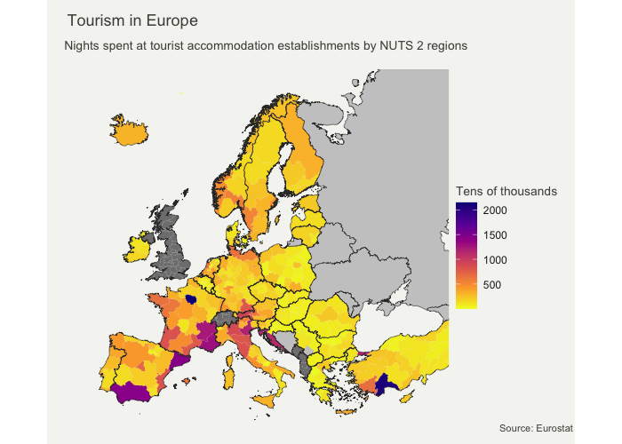
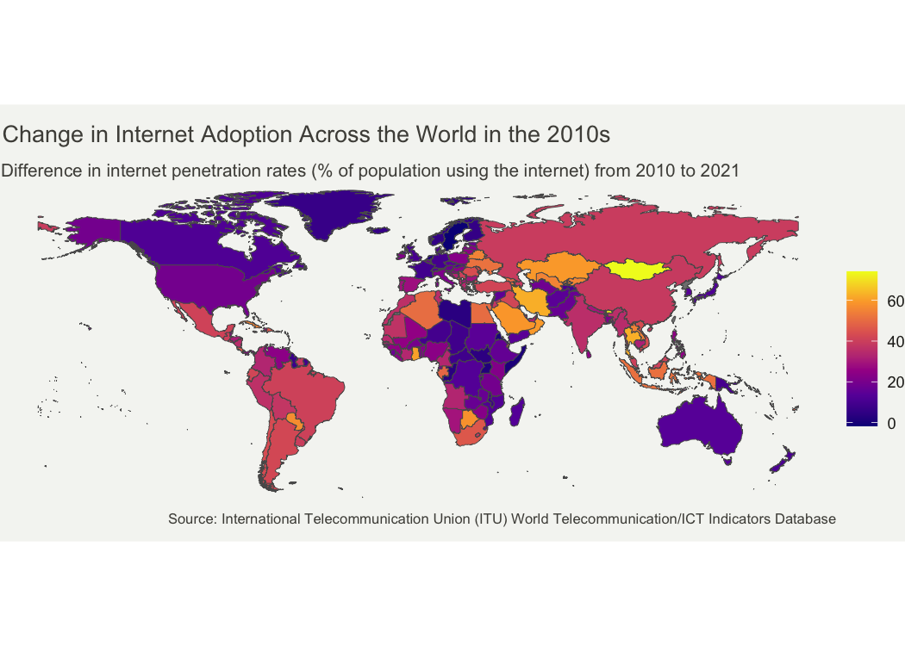
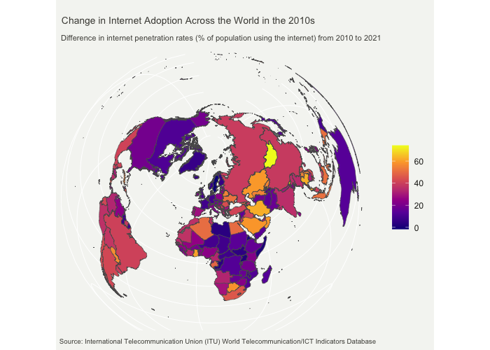

Assignment \#4 - Making Maps
================
Matteo Larrode

## Map 1: Change in Internet Adoption Across the World in the 2010s

For this world map, I use the
[rnaturalearth](https://cran.r-project.org/web/packages/rnaturalearth/vignettes/rnaturalearth.html)
package that provides map data that can be visualized using other R
packages. I will be mapping World Bank data using the
[wbstats](https://cran.r-project.org/web/packages/wbstats/vignettes/wbstats.html)
package.

Let’s first load the packages we will need for the map.

<details>
<summary>Code</summary>

``` r
library(tidyverse)
library(ggplot2)
library(wbstats)
library(rnaturalearth)
```

</details>

I am interested in Internet penetration over the world. But instead of
mapping its most recent value in every country, I chose to map changes
in its rate. To reach this objective, some data wrangling is necessary
first.

<details>
<summary>Code</summary>

``` r
# set indicator variable to internet users (%) & get its info for later
ind <- "IT.NET.USER.ZS"
indicator_info <- filter(wb_cachelist$indicators, indicator_id == ind)

#get world map as sf object
world <- ne_countries(scale = "medium", returnclass = "sf") %>%
  filter(iso_a3 != "ATA") # remove Antarctica

#get data for internet users (from 2010)
internet_data <- wb_data(ind, start_date = 2010, end_date = 2023)

#DIFFERENCE BETWEEN OLDEST & NEWEST RECORDED VALUES 
#first: mutate data set to add columns with oldest and newest years recorded 
internet_data <- internet_data %>%
  filter(!is.na(IT.NET.USER.ZS))%>%
  group_by(iso3c)%>%
  mutate(min_year = min(date),
         max_year = max(date)) %>% 
  ungroup() %>%
  filter(date == min_year | date == max_year)

#then: compute the % difference between oldest and newest values
final_internet_data <- internet_data %>%
  group_by(iso3c) %>%
  arrange(date, .by_group = TRUE) %>%
  mutate(
    #percent change
    diff_users_pct = (IT.NET.USER.ZS - lag(IT.NET.USER.ZS, default = first(IT.NET.USER.ZS))) /
           lag(IT.NET.USER.ZS, default = 1)*100, 
    #absolute change
    diff_users_abs = IT.NET.USER.ZS - lag(IT.NET.USER.ZS, default = first(IT.NET.USER.ZS)),
    #rate change
    diff_users_x = IT.NET.USER.ZS / lag(IT.NET.USER.ZS, default = first(IT.NET.USER.ZS))) %>%
  filter(diff_users_abs != 0)


#now join the geography dataset & the internet users data
users_world_df <- left_join(world, final_internet_data, by = c("iso_a3" = "iso3c"))
```

</details>

Now on to the mapping!

<details>
<summary>Code</summary>

``` r
it_users_map <- ggplot(users_world_df, aes(fill = diff_users_abs)) +
  geom_sf() +

  theme_void()+
  #more adjustements
  theme(text = element_text(color = "#22211d"),
        plot.margin = margin(0.5, 0.5, 0.5, 0.5, "cm"),
        plot.background = element_rect(fill = "#f5f5f2", color = NA), 
        panel.background = element_rect(fill = "#f5f5f2", color = NA), 
        legend.background = element_rect(fill = "#f5f5f2", color = NA),
        
        plot.title = element_text(size= 13, hjust=0.01, color = "#4e4d47",
                                margin = margin(b = -0.1, t = 0.4, l = 2, unit = "cm")),
        plot.subtitle = element_text(size= 10, hjust=0.01, color = "#4e4d47",
                                margin = margin(b = -0.1, t = 0.43, l = 2, unit = "cm")),
        plot.caption = element_text( size=8, color = "#4e4d47", 
                                 margin = margin(t = 0.7, b = 0.3, r=-99, unit = "cm")),
        legend.position = "bottom",
        legend.text = element_text(size = 8),
        legend.key.height= unit(0.3, 'cm'),
        legend.key.width= unit(1.5, 'cm'))+
  
  scale_fill_viridis_c(option = "plasma")+
  labs(title = "Change in Internet Penetration Across the World in the 2010s",
       subtitle = "Absolute change in % of population with access to the Internet from 2010 to 2021",
    fill = NULL,
    caption = paste("Source:", indicator_info$source_org))

it_users_map
```

</details>


This first map displays changes in Internet penetration rates throughout
the world in the 2010s. It uses a sequential, gradient color scheme,
where warmer colors are associated with bigger changes.

The first choice was to represent change of Internet penetration instead
of the current or past penetration rate itself. Here, the map does not
display the amount of people having access to the Internet in each
country, but the development of said access over a period of time.
Developed countries that already had widespread access to the Internet
in 2010, mostly in Europe, North America and Australia are therefore
associated with smaller changes.

This map shows the major increase in Internet penetration that has
occurred in South and Central America in the 2010s, with increases of
more than 30 percentage points. Many countries in South-East Asia,
Central Asia, and the Middle East have experienced similar increases,
with some exceptions. And while some African countries did undergo
significant increases in penetration rates, especially in the North and
South, the continent still lags behind in terms of the development of
its Internet infrastructure.

The choice of how to represent change is very important too. The choice
made here is to use the absolute change in penetration rate. This
measure favours countries that developed access to the Internet to a
large number of their population over the period of time studied.
Another option was to map the growth rate, that is the percentage of
increase for each country over the time period studied. Doing so would
have given very different results, especially for countries with low
penetration rates.

For example, Angola went from a penetration rate of around 3% to 36%.
This represents a growth of more than 1,000%! The country multiplied its
access to the Internet by 12, but this corresponds to an absolute
increase of only 33 percentage points. In contrast, Brazil jumped from
41% to 81%, an absolute increase of 40 percentage points, while it only
doubled its access to the Internet with a growth of 100% over the ten
years.

Therefore, a map representing relative growth of Internet penetration
rates would have looked very different, and told a very different story
than the one displayed in this report. I would use growth rates, most
likely with a log scale, if I were to map the same variable on the scale
of a single continent; it would allows to better compare the development
efforts of nations that share similar characteristics and penetration
rates.

## Map 2: Tourism in Europe

I have used the [eurostat R
package](https://github.com/rOpenGov/eurostat), that contains tools to
access open data from [Eurostat](https://ec.europa.eu/eurostat), a
database of high-quality statistics and data on Europe.

An important concept here is the [Nomenclature of territorial units for
statistics (NUTS)](https://ec.europa.eu/eurostat/web/nuts/background)
classification. It is the system for dividing up the economic territory
of the EU and the UK for the purpose of the socio-economic analyses of
the regions. We will be using data on the NUTS 2 level, which is the
statistical unit of approximately 800,000 to 3 million people.

For the spatial data, we will use the [giscoR
package](https://cran.r-project.org/web/packages/giscoR/vignettes/giscoR.html).
This package provides an easy interaction with the GISCO API, which
gives access to a database containing core geographical data covering
the whole of Europe at different levels.

Let’s first load the packages we will need for the map.

<details>
<summary>Code</summary>

``` r
library(tidyverse)
library(sf)
library(ggplot2)
library(eurostat) #pull data from eurostat
library(giscoR) #pull NUTS 2 & country shapefiles
```

</details>

I am interested in regional tourism statistics, so the indicator I will
be mapping is the occupancy in collective accommodation establishments.
More precisely, the arrivals at tourist accommodation establishments by
NUTS 2 regions.

For this data wrangling, it is important to note that, although the last
year measured is 2022, some regions only have data for 2021. We will
therefore use the most recent available data for each region.

<details>
<summary>Code</summary>

``` r
#1.NUTS2 AND SHAPEFILES ---------

#define longlat projection
crsLONGLAT <- "+proj=longlat +datum=WGS84 +no_defs +ellps=WGS84 +towgs84=0,0,0"

#get sf object of Europe
nuts2 <- giscoR::gisco_get_nuts(
    year = "2021",
    resolution = "3",
    nuts_level = "2") %>%
  sf::st_transform(crsLONGLAT)

#get country codes
cntrys <- giscoR::gisco_get_countries(
    year = "2020",
    resolution = "3",
    region = c("Europe", "Asia")) %>%
    sf::st_transform(crsLONGLAT)

# Countries in giscoR object but NOT in eurostat dataset
# BA = Bosnia & Herzegovina
# BY = Belarus; GE = Georgia
# MD = Moldova; RU = Russia
# UA = Ukraine
non_eu_list <- c(
    "BA", "BY", "GE",
    "MD", "RU", "UA")

eu_list <- c(unique(nuts2$CNTR_CODE))

eu <- cntrys |>
    filter(CNTR_ID %in% eu_list)

non_eu <- cntrys |>
    filter(CNTR_ID %in% non_eu_list)

#2. EUROSTAT DATA -----------
#indicator for our variable of interest
ind2 <- "tour_occ_arn2"

# get NUTS2-level data
eurostat_df <- eurostat::get_eurostat(
  ind2,
  time_format = "num") %>%
filter(nace_r2 == "I551-I553" & time >= 2020 & c_resid == "TOTAL" & unit == "NR") %>%
select(geo, time, values) %>%
mutate(values = round(values / 10000))

names(eurostat_df)[1] <- "NUTS_ID"


#convert to wide data and keep only latest data
wide_df <- pivot_wider(eurostat_df, 
                       names_from = time,
                       values_from = values)%>%
  mutate(values = if_else(is.na(`2022`), `2021`, `2022`)) %>%
  select(NUTS_ID, values)


#3. MERGE SHP AND DATA -----------
df <- left_join(nuts2, wide_df, by = "NUTS_ID")
```

</details>

Now that we have merged the shapefile and data from Eurostat, following
the NUTS 2 classification, we can map our chosen indicator

<details>
<summary>Code</summary>

``` r
#bounding box
crsLAEA <- "+proj=laea +lat_0=52 +lon_0=10 +x_0=4321000 +y_0=3210000 +datum=WGS84 +units=m +no_defs"

get_bounding_box_europe <- function() {
    xmin <- -10.6600
    xmax <- 36.5500
    ymin <- 34.5000
    ymax <- 71.0500

    bbox_laea <- sf::st_sfc(
      st_polygon(list(cbind(c(xmin, xmax, xmax, xmin, xmin),
                            c(ymin, ymin, ymax, ymax, ymin)))),
      crs = crsLONGLAT) %>%
      st_transform(crsLAEA)

    bbox <- st_bbox(bbox_laea)
    return(bbox)
}
bbox <- get_bounding_box_europe()
```

</details>
<details>
<summary>Code</summary>

``` r
tourism_eu_map <- ggplot(df, aes(fill = values)) +
  #make russia & non_eu countries grey b/c no data
  geom_sf(data = filter(eu, CNTR_ID == "RS"),
          color = "grey20", size = 0.15, fill = "#cacaca") +
  geom_sf(data = non_eu, 
          color = "grey20", size = 0.125, fill = "#cacaca") +
  
  geom_sf(data = df, color = NA, size = 0) +
  geom_sf(data = eu, color = "grey20", size = 0.125, fill = "transparent") +
    
  coord_sf(
        crs = crsLAEA,
        xlim = c(bbox["xmin"], bbox["xmax"]),
        ylim = c(bbox["ymin"], bbox["ymax"])) +
  
  theme_void()+
  #more adjustements
  theme(text = element_text(color = "#22211d"), 
        plot.margin = margin(0, 0.5, 0, 0.5, "cm"),
        plot.background = element_rect(fill = "#f5f5f2", color = NA),
        panel.background = element_rect(fill = "#f5f5f2", color = NA), 
        legend.background = element_rect(fill = "#f5f5f2", color = NA),
        
        plot.title = element_text(size= 13, hjust=0.01, color = "#4e4d47",
                                margin = margin(b = -0.1, t = 0.4, l = 2, unit = "cm")),
        plot.subtitle = element_text(size= 10, hjust=0.01, color = "#4e4d47",
                                margin = margin(b = 0.5, t = 0.43, l = 2, unit = "cm")),
        plot.caption = element_text( size=8, color = "#4e4d47", 
                                 margin = margin(b = 0.3, r=-99, unit = "cm"),
                                 hjust = 1.4),
        legend.position = "right",
        legend.title = element_text(color = "#4e4d47", size = 10))+
  
  scale_fill_viridis_c(option = "plasma", direction = -1)+
  labs(
    title = "Tourism in Europe",
    subtitle = "Nights spent at tourist accommodation establishments by NUTS 2 regions",
    fill = "Tens of thousands",
    caption = paste("Source: Eurostat"))

tourism_eu_map
```

</details>



While the default “fill” in the first map worked fine, here, we notice
that most observations are on the lower end of the spectrum. With only a
few regions distinguisly higher than the rest. This map would benefit
from having a legend split into breaks

Describe the patterns in your map. What story are you communicating with
your map? Does the map effectively communicate your story? Why or why
not?

## Alternative Maps

### From gradient color scheme to classed scale

<details>
<summary>Code</summary>

``` r
it_users_map2 <- ggplot(users_world_df, aes(fill = diff_users)) +
  geom_sf() +

  theme_void()+
  #more adjustements
  theme(text = element_text(color = "#22211d"), 
        plot.background = element_rect(fill = "#f5f5f2", color = NA), 
        panel.background = element_rect(fill = "#f5f5f2", color = NA), 
        legend.background = element_rect(fill = "#f5f5f2", color = NA),
        
        plot.title = element_text(size= 13, hjust=0.01, color = "#4e4d47",
                                margin = margin(b = -0.1, t = 0.4, l = 2, unit = "cm")),
        plot.subtitle = element_text(size= 10, hjust=0.01, color = "#4e4d47",
                                margin = margin(b = -0.1, t = 0.43, l = 2, unit = "cm")),
        plot.caption = element_text( size=8, color = "#4e4d47", 
                                 margin = margin(b = 0.3, r=-99, unit = "cm")),
        legend.position = "right")+
  
  scale_fill_viridis_c(option = "plasma")+
  labs(
    title = "Change in Internet Adoption Across the World in the 2010s",
    subtitle = "Difference in internet penetration rates (% of population using the internet) from 2010 to 2021",
    fill = NULL,
    caption = paste("Source:", indicator_info$source_org))

it_users_map2
```

</details>



How does the new choice affect the map? Does the original or modified
approach better represent the data? Why?

### From sequential to divergent scale

<details>
<summary>Code</summary>

``` r
2 * 2
```

</details>

    [1] 4

How does the new choice affect the map? Does the original or modified
approach better represent the data? Why?

### Bonus map: Change of coordinates

<details>
<summary>Code</summary>

``` r
it_users_map2 <- ggplot(users_world_df, aes(fill = diff_users)) +
  geom_sf() +

  coord_sf(crs = "+proj=laea +lat_0=52 +lon_0=10 +x_0=4321000 +y_0=3210000 +ellps=GRS80 +units=m +no_defs ")+

  #more adjustements
  theme(text = element_text(color = "#22211d"), 
        plot.background = element_rect(fill = "#f5f5f2", color = NA), 
        panel.background = element_rect(fill = "#f5f5f2", color = NA), 
        legend.background = element_rect(fill = "#f5f5f2", color = NA),
        
        axis.text = element_blank(),
        axis.ticks = element_blank(),
        plot.title = element_text(size= 10, hjust=0.01, color = "#4e4d47",
                                margin = margin(b = -0.1, t = 0.4, l = 2, unit = "cm")),
        plot.subtitle = element_text(size= 8, hjust=0.01, color = "#4e4d47",
                                margin = margin(b = -0.1, t = 0.43, l = 2, unit = "cm")),
        plot.caption = element_text( size=7, color = "#4e4d47"),       
        legend.position = "right")+
    scale_fill_viridis_c(option = "plasma")+
    labs(
    title = "Change in Internet Adoption Across the World in the 2010s",
    subtitle = "Difference in internet penetration rates (% of population using the internet) from 2010 to 2021",
    fill = NULL,
    caption = paste("Source:", indicator_info$source_org))

it_users_map2
```

</details>


