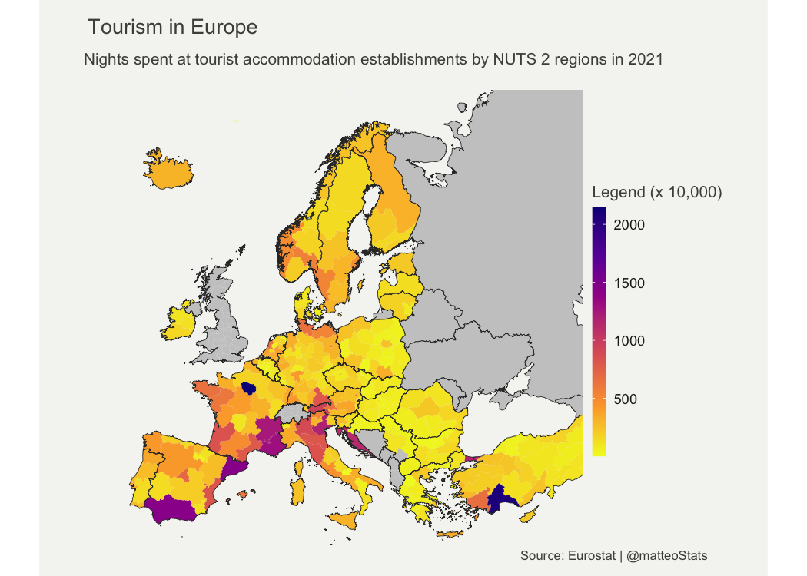
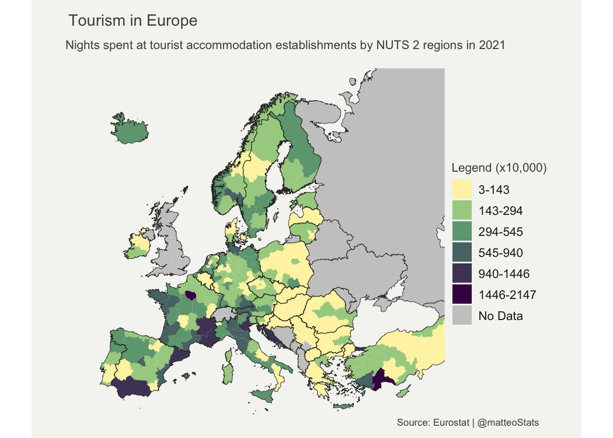
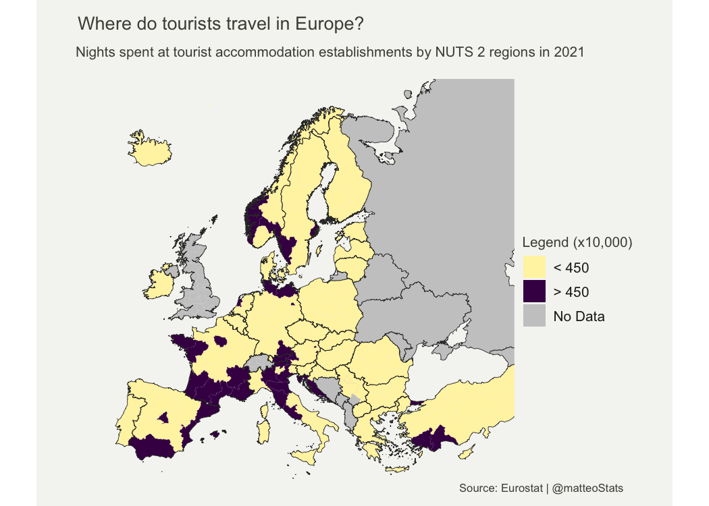
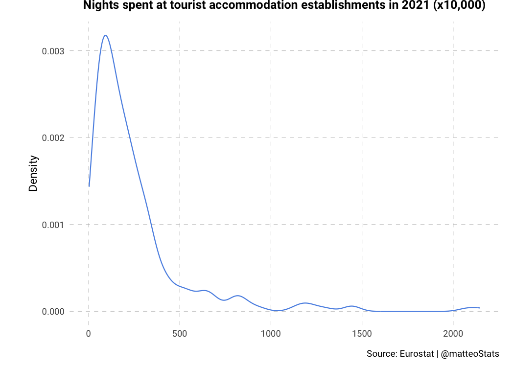

Assignment \#4 - Making Maps
================
Matteo Larrode

## Map 1: Change in Internet Adoption Across the World in the 2010s

For this world map, I use the
[rnaturalearth](https://cran.r-project.org/web/packages/rnaturalearth/vignettes/rnaturalearth.html)
package that provides map data that can be visualized using other R
packages. I will be mapping World Bank data using the
[wbstats](https://cran.r-project.org/web/packages/wbstats/vignettes/wbstats.html)
package.

Let’s first load the packages we will need for the map.

<details>
<summary>Code</summary>

``` r
library(tidyverse)
library(ggplot2)
library(wbstats)
library(rnaturalearth)
```

</details>

I am interested in Internet penetration over the world. But instead of
mapping its most recent value in every country, I chose to map changes
in its rate. To reach this objective, some data wrangling is necessary
first.

<details>
<summary>Code</summary>

``` r
# set indicator variable to internet users (%) & get its info for later
ind <- "IT.NET.USER.ZS"
indicator_info <- filter(wb_cachelist$indicators, indicator_id == ind)

#get world map as sf object
world <- ne_countries(scale = "medium", returnclass = "sf") %>%
  filter(iso_a3 != "ATA") # remove Antarctica

#get data for internet users (from 2010)
internet_data <- wb_data(ind, start_date = 2010, end_date = 2023)

#DIFFERENCE BETWEEN OLDEST & NEWEST RECORDED VALUES 
#first: mutate data set to add columns with oldest and newest years recorded 
internet_data <- internet_data %>%
  filter(!is.na(IT.NET.USER.ZS))%>%
  group_by(iso3c)%>%
  mutate(min_year = min(date),
         max_year = max(date)) %>% 
  ungroup() %>%
  filter(date == min_year | date == max_year)

#then: compute the % difference between oldest and newest values
final_internet_data <- internet_data %>%
  group_by(iso3c) %>%
  arrange(date, .by_group = TRUE) %>%
  mutate(
    #percent change
    diff_users_pct = (IT.NET.USER.ZS - lag(IT.NET.USER.ZS, default = first(IT.NET.USER.ZS))) /
           lag(IT.NET.USER.ZS, default = 1)*100, 
    #absolute change
    diff_users_abs = IT.NET.USER.ZS - lag(IT.NET.USER.ZS, default = first(IT.NET.USER.ZS)),
    #rate change
    diff_users_x = IT.NET.USER.ZS / lag(IT.NET.USER.ZS, default = first(IT.NET.USER.ZS))) %>%
  filter(diff_users_abs != 0)


#now join the geography dataset & the internet users data
users_world_df <- left_join(world, final_internet_data, by = c("iso_a3" = "iso3c"))
```

</details>

Now on to the mapping!

<details>
<summary>Code</summary>

``` r
it_users_map <- ggplot(users_world_df, aes(fill = diff_users_abs)) +
  geom_sf() +

  theme_void()+
  #more adjustements
  theme(text = element_text(color = "#22211d"),
        plot.margin = margin(0.5, 0.5, 0.5, 0.5, "cm"),
        plot.background = element_rect(fill = "#f5f5f2", color = NA), 
        panel.background = element_rect(fill = "#f5f5f2", color = NA), 
        legend.background = element_rect(fill = "#f5f5f2", color = NA),
        
        plot.title = element_text(size= 13, hjust=0.01, color = "#4e4d47",
                                margin = margin(b = -0.1, t = 0.4, l = 2, unit = "cm")),
        plot.subtitle = element_text(size= 10, hjust=0.01, color = "#4e4d47",
                                margin = margin(b = -0.1, t = 0.43, l = 2, unit = "cm")),
        plot.caption = element_text( size=8, color = "#4e4d47", 
                                 margin = margin(t = 0.7, b = 0.3, r=-99, unit = "cm")),
        legend.position = "bottom",
        legend.text = element_text(size = 8),
        legend.key.height= unit(0.3, 'cm'),
        legend.key.width= unit(1.5, 'cm'))+
  
  scale_fill_viridis_c(option = "plasma")+
  labs(title = "Change in Internet Penetration Across the World in the 2010s",
       subtitle = "Absolute change in % of population with access to the Internet from 2010 to 2021",
    fill = NULL,
    caption = paste("Source:", indicator_info$source_org, " | @matteoStats"))

it_users_map
```

</details>


This first map displays changes in Internet penetration rates throughout
the world in the 2010s. It uses a sequential, gradient color scheme,
where warmer colors are associated with bigger changes.

The first choice was to represent change of Internet penetration instead
of the current or past penetration rate itself. Here, the map does not
display the amount of people having access to the Internet in each
country, but the development of said access over a period of time.
Developed countries that already had widespread access to the Internet
in 2010, mostly in Europe, North America and Australia are therefore
associated with smaller changes.

This map shows the major increase in Internet penetration that has
occurred in South and Central America in the 2010s, with increases of
more than 30 percentage points. Many countries in South-East Asia,
Central Asia, and the Middle East have experienced similar increases,
with some exceptions. And while some African countries did undergo
significant increases in penetration rates, especially in the North and
South, the continent still lags behind in terms of the development of
its Internet infrastructure.

The choice of how to represent change is very important too. The choice
made here is to use the absolute change in penetration rate. This
measure favours countries that developed access to the Internet to a
large number of their population over the period of time studied.
Another option was to map the growth rate, that is the percentage of
increase for each country over the time period studied. Doing so would
have given very different results, especially for countries with low
penetration rates.

For example, Angola went from a penetration rate of around 3% to 36%.
This represents a growth of more than 1,000%! The country multiplied its
access to the Internet by 12, but this corresponds to an absolute
increase of only 33 percentage points. In contrast, Brazil jumped from
41% to 81%, an absolute increase of 40 percentage points, while it only
doubled its access to the Internet with a growth of 100% over the ten
years.

Therefore, a map representing relative growth of Internet penetration
rates would have looked very different, and told a very different story
than the one displayed in this report. I would use growth rates, most
likely with a log scale, if I were to map the same variable on the scale
of a single continent; it would allows to better compare the development
efforts of nations that share similar characteristics and penetration
rates.

## Map 2: Tourism in Europe

I have used the [eurostat R
package](https://github.com/rOpenGov/eurostat), that contains tools to
access open data from [Eurostat](https://ec.europa.eu/eurostat), a
database of high-quality statistics and data on Europe.

An important concept here is the [Nomenclature of territorial units for
statistics (NUTS)](https://ec.europa.eu/eurostat/web/nuts/background)
classification. It is the system for dividing up the economic territory
of the EU and the UK for the purpose of the socio-economic analyses of
the regions. We will be using data on the NUTS 2 level, which is the
statistical unit of approximately 800,000 to 3 million people.

For the spatial data, we will use the [giscoR
package](https://cran.r-project.org/web/packages/giscoR/vignettes/giscoR.html).
This package provides an easy interaction with the GISCO API, which
gives access to a database containing core geographical data covering
the whole of Europe at different levels.

Let’s first load the packages we will need for the map.

<details>
<summary>Code</summary>

``` r
library(tidyverse)
library(sf)
library(ggplot2)
library(eurostat) #pull data from eurostat
library(giscoR) #pull NUTS 2 & country shapefiles
```

</details>

I am interested in regional tourism statistics, so the indicator I will
be mapping is the occupancy in collective accommodation establishments.
More precisely, the arrivals at tourist accommodation establishments by
NUTS 2 regions.

<details>
<summary>Code</summary>

``` r
#1.NUTS2 AND SHAPEFILES ---------

#define longlat projection
crsLONGLAT <- "+proj=longlat +datum=WGS84 +no_defs +ellps=WGS84 +towgs84=0,0,0"

#get sf object of Europe -> NUTS 2 level
nuts2 <- giscoR::gisco_get_nuts(
    year = "2021",
    resolution = "3",
    nuts_level = "2") %>%
  sf::st_transform(crsLONGLAT)

#get sf object of countries -> overlay map with national boundary map
cntrys <- giscoR::gisco_get_countries(
    year = "2020",
    resolution = "3",
    region = c("Europe", "Asia")) %>%   #Asia included for Cyprus and Moldova
    sf::st_transform(crsLONGLAT)

# Countries in giscoR object but NOT in eurostat dataset
# BA = Bosnia & Herzegovina
# BY = Belarus; GE = Georgia
# MD = Moldova; RU = Russia
# UA = Ukraine
non_eu_list <- c(
    "BA", "BY", "GE",
    "MD", "RU", "UA")

#countries in eurostat dataset
eu_list <- c(unique(nuts2$CNTR_CODE))

#European countries we want mapped
eu <- cntrys %>%
    filter(CNTR_ID %in% eu_list)

#Non-EU countries we want mapped too
non_eu <- cntrys %>%
    filter(CNTR_ID %in% non_eu_list)
```

</details>

For this data wrangling, it is important to note that, although the last
year measured is 2022, some regions only have data for 2021. We will
therefore use the most recent available data for each region.

<details>
<summary>Code</summary>

``` r
#2. EUROSTAT DATA -----------
#indicator for our variable of interest
ind2 <- "tour_occ_arn2"

# get NUTS2-level data
eurostat_df <- eurostat::get_eurostat(ind2, time_format = "num") %>%
  filter(nace_r2 == "I551-I553" & time >= 2020 & c_resid == "TOTAL" & unit == "NR") %>%
  select(geo, time, values) %>%
  mutate(values = round(values / 10000))

names(eurostat_df)[1] <- "NUTS_ID"


#convert to wide data and keep only latest data
wide_df <- pivot_wider(eurostat_df, 
                       names_from = time,
                       values_from = values)%>%
  mutate(values = if_else(is.na(`2022`), `2021`, `2022`)) %>%
  select(NUTS_ID, values)


#3. MERGE SHP AND DATA -----------
df <- left_join(nuts2, wide_df, by = "NUTS_ID")
```

</details>

Now that we have merged the shapefile and data from Eurostat, following
the NUTS 2 classification, we can map our chosen indicator

<details>
<summary>Code</summary>

``` r
#Lambert projection
crsLAEA <- "+proj=laea +lat_0=52 +lon_0=10 +x_0=4321000 +y_0=3210000 +datum=WGS84 +units=m +no_defs"

#bounding box -> center on Europe & omit oversees territories

get_bounding_box_europe <- function() {
    xmin <- -10.6600
    xmax <- 36.5500
    ymin <- 34.5000
    ymax <- 71.0500

    bbox_laea <- sf::st_sfc(
      st_polygon(list(cbind(c(xmin, xmax, xmax, xmin, xmin),
                            c(ymin, ymin, ymax, ymax, ymin)))),
      crs = crsLONGLAT) %>%
      st_transform(crsLAEA)

    bbox <- st_bbox(bbox_laea)
    return(bbox)
}
bbox <- get_bounding_box_europe()
```

</details>
<details>
<summary>Code</summary>

``` r
tourism_eu_map <- ggplot() +
  #fix issue with Kosovo (considered a part of Serbia in the country shp) -> grey base layer 
  geom_sf(data = filter(eu, CNTR_ID == "RS"),
          color = "grey20", size = 0.15, fill = "#cacaca") +
  #make non_eu countries grey b/c no Eurostat data
  geom_sf(data = non_eu, 
          color = "grey20", size = 0.125, fill = "#cacaca") +
  #plot data BUT removing the borders (NUTS2 are too complicated)
  geom_sf(data = df, aes(fill = values), color = NA, size = 0) +
  #add country borders (but without filling the polygons)
  geom_sf(data = eu, color = "grey20", size = 0.125, fill = "transparent") +
    
  coord_sf(
        crs = crsLAEA,
        xlim = c(bbox["xmin"], bbox["xmax"]),
        ylim = c(bbox["ymin"], bbox["ymax"])) +
  
  theme_void()+
  #more adjustements
  theme(text = element_text(color = "#22211d"), 
        plot.margin = margin(0, 1, 0, 1, "cm"),
        plot.background = element_rect(fill = "#f5f5f2", color = NA),
        panel.background = element_rect(fill = "#f5f5f2", color = NA), 
        legend.background = element_rect(fill = "#f5f5f2", color = NA),
        
        plot.title = element_text(size= 13, hjust=0.01, color = "#4e4d47",
                                margin = margin(b = -0.1, t = 0.4, l = 2, unit = "cm")),
        plot.subtitle = element_text(size= 10, hjust=0.01, color = "#4e4d47",
                                margin = margin(b = 0.5, t = 0.43, l = 2, unit = "cm")),
        plot.caption = element_text( size=8, color = "#4e4d47", 
                                 margin = margin(b = 0.3, r=-99, unit = "cm"),
                                 hjust = 1.4),
        legend.position = "right",
        legend.title = element_text(color = "#4e4d47", size = 10))+
  
  scale_fill_viridis_c(option = "plasma", direction = -1, na.value = "#cacaca")+
  labs(
    title = "Tourism in Europe",
    subtitle = "Nights spent at tourist accommodation establishments by NUTS 2 regions in 2021",
    fill = "Legend (x 10,000)",
    caption = paste("Source: Eurostat | @matteoStats"))

tourism_eu_map
```

</details>



While the default “fill” in the first map worked fine, here, we notice
that most observations are on the lower end of the spectrum. With only a
few regions distinguisly higher than the rest. This map would benefit
from having a legend split into breaks

Describe the patterns in your map. What story are you communicating with
your map? Does the map effectively communicate your story? Why or why
not?

## Alternative Maps

### From gradient color scheme to classed scale

The map of Europe shown above used an unclassed gradient scale. I will
now make a map using a classed colour scheme.

First, legend breaks need to be determined and created. I will use the
[classInt](https://cran.r-project.org/web/packages/classInt/classInt.pdf)
package to help with this task. I chose to create 6 intervals, allowing
to giving enough information, while avoiding to overcrowd the legend.
The method used is the [Jenks natural breaks classification
method](https://en.wikipedia.org/wiki/Jenks_natural_breaks_optimization).
It is a convenient method that minimizes the variance within classes,
while maximizing variance between classes.

<details>
<summary>Code</summary>

``` r
library(classInt)
library(forcats)

#breaks
brks <- classIntervals(df$values, n = 6, style = "jenks")$brks

#labels (iterate through breaks)
labels <- c()
for (i in 1:(length(brks)-1)) {
    labels <- c(labels, paste0(round(brks[i], 0), "-", round(brks[i + 1], 0)))}

#use cut function to  carve out the categorical variable based on the breaks and labels
# and replace NAs with "No Data" 
df <- df %>%
  mutate(values_classed = cut(values, breaks = brks, labels = labels, include.lowest = T),
         #!! the variable is FACTOR data so we need to create a new factor
         values_classed = fct_expand(values_classed, "No Data"),
         values_classed = fct_explicit_na(values_classed, na_level = "No Data"))

#get colourblind friendly palette for the mapping
colours <- c("#fff3b0", "#a7d08f","#6ea57f", "#587573", "#4f4365","#440154", "#cacaca")
```

</details>

Now onto the mapping!

<details>
<summary>Code</summary>

``` r
tourism_eu_map_classed <- ggplot() +
  #fix issue with Kosovo (considered a part of Serbia in the country shp) -> grey base layer 
  geom_sf(data = filter(eu, CNTR_ID == "RS"),
          color = "grey20", size = 0.15, fill = "#cacaca") +
  #make non_eu countries grey b/c no Eurostat data
  geom_sf(data = non_eu, 
          color = "grey20", size = 0.125, fill = "#cacaca") +
  #plot data BUT removing the borders (NUTS2 are too complicated)
  geom_sf(data = df, aes(fill = values_classed), color = NA, size = 0) +
  #add country borders (but without filling the polygons)
  geom_sf(data = eu, color = "grey20", size = 0.125, fill = "transparent") +
    
  coord_sf(
        crs = crsLAEA,
        xlim = c(bbox["xmin"], bbox["xmax"]),
        ylim = c(bbox["ymin"], bbox["ymax"])) +
  
  scale_fill_manual(
        name = "Legend (x10,000)",
        values = colours,
        drop = F) +
  
  theme_void()+
  #more adjustements
  theme(text = element_text(color = "#22211d"), 
        plot.margin = margin(0, 1, 0, 1, "cm"),
        plot.background = element_rect(fill = "#f5f5f2", color = NA),
        panel.background = element_rect(fill = "#f5f5f2", color = NA), 
        legend.background = element_blank(),
        
        plot.title = element_text(size= 13, hjust=0.01, color = "#4e4d47",
                                margin = margin(b = -0.1, t = 0.4, l = 2, unit = "cm")),
        plot.subtitle = element_text(size= 10, hjust=0.01, color = "#4e4d47",
                                margin = margin(b = 0.5, t = 0.43, l = 2, unit = "cm")),
        plot.caption = element_text( size=8, color = "#4e4d47", 
                                 margin = margin(b = 0.3, r=-99, unit = "cm"),
                                 hjust = 1.4),
        legend.position = "right",
        legend.text = element_text(size = 10),
        legend.title = element_text(color = "#4e4d47", size = 10))+
  
  labs(title = "Tourism in Europe",
       subtitle = "Nights spent at tourist accommodation establishments by NUTS 2 regions in 2021",
       caption = paste("Source: Eurostat | @matteoStats"))

tourism_eu_map_classed
```

</details>



The main advantage of classed maps is the ability to read the value
range for the regions correctly, on the contrary of unclassed maps where
the viewer can only make guesses.

On the other hand, unclassed maps work best to show a general pattern,
and give a nuance view of the data. An unclassed choropleth is the most
exact representation of spatial data model possible, so if complexity is
a goal in the mapping process, an unclassed maps is most likely the
right choice. Unclassed maps make it easier to see outliers, the
abruptness of the transition between clusters, and differences between
neighboring regions.

The classed map above with 6 classes communicates the same message as
the unclassed map made earlier, but with less nuance. When simply
mapping the number of nights spent by tourists in each region, the
priority is on showing general patterns, and the unclassed maps is more
precise. In this case, the slight gain in readability that is brought by
the classed map does not offset the loss in nuance.

Moreover, because of the distribution of the data, the categories differ
strongly in their intervals. The first category has a range of 140 while
the last one has a range of around 700. These differences allow to gain
better insight and precision on the data, but can confuse inattentive or
uninformed viewers.

As a bonus, I will make a map that makes a specific point. From the maps
above, we can see that some regions host a lot more tourists than the
others, which have similar values. A classed map with two categories
could be efficient to give a very simple answer to the question “Which
regions host the most tourists?”.

<details>
<summary>Code</summary>

``` r
# data wrangling: new variable with 2 categories 
df <- df %>%
  mutate(values_binary = factor(ifelse(values > 450, "> 450", "< 450")),
         #!! the variable is FACTOR data so we need to create a new factor
         values_binary = fct_expand(values_binary, "No Data"),
         values_binary = fct_explicit_na(values_binary, na_level = "No Data"))

colours2 <- colours <- c("#fff3b0","#440154", "#cacaca")

#map
tourism_eu_map_classed2 <- ggplot() +
  #fix issue with Kosovo (considered a part of Serbia in the country shp) -> grey base layer 
  geom_sf(data = filter(eu, CNTR_ID == "RS"),
          color = "grey20", size = 0.15, fill = "#cacaca") +
  #make non_eu countries grey b/c no Eurostat data
  geom_sf(data = non_eu, 
          color = "grey20", size = 0.125, fill = "#cacaca") +
  #plot data BUT removing the borders (NUTS2 are too complicated)
  geom_sf(data = df, aes(fill = values_binary), color = NA, size = 0) +
  #add country borders (but without filling the polygons)
  geom_sf(data = eu, color = "grey20", size = 0.125, fill = "transparent") +
    
  coord_sf(
        crs = crsLAEA,
        xlim = c(bbox["xmin"], bbox["xmax"]),
        ylim = c(bbox["ymin"], bbox["ymax"])) +
  
  scale_fill_manual(
        name = "Legend (x10,000)",
        values = colours,
        drop = F) +
  
  theme_void()+
  #more adjustements
  theme(text = element_text(color = "#22211d"), 
        plot.margin = margin(0, 1, 0, 1, "cm"),
        plot.background = element_rect(fill = "#f5f5f2", color = NA),
        panel.background = element_rect(fill = "#f5f5f2", color = NA), 
        legend.background = element_blank(),
        
        plot.title = element_text(size= 13, hjust=0.01, color = "#4e4d47",
                                margin = margin(b = -0.1, t = 0.4, l = 2, unit = "cm")),
        plot.subtitle = element_text(size= 10, hjust=0.01, color = "#4e4d47",
                                margin = margin(b = 0.5, t = 0.43, l = 2, unit = "cm")),
        plot.caption = element_text( size=8, color = "#4e4d47", 
                                 margin = margin(b = 0.3, r=-99, unit = "cm"),
                                 hjust = 1.4),
        legend.position = "right",
        legend.text = element_text(size = 10),
        legend.title = element_text(color = "#4e4d47", size = 10))+
  
  labs(title = "Where do tourists travel in Europe?",
       subtitle = "Nights spent at tourist accommodation establishments by NUTS 2 regions in 2021",
       caption = paste("Source: Eurostat | @matteoStats"))

tourism_eu_map_classed2
```

</details>



This map shows the outliers, answering efficiently the question asked in
the title. Tourists seem to be attracted to coastal regions, especially
around the Mediterranean, Scandinavia and the south of Turkey. Some
capitals like Paris and Madrid also stand out in this map.

A classed color scale allows to make a specific point more easily than
its unclassed counterpart. Grouping regions with the same color together
makes it easier for viewers to understand the statement made by the
mapper. The focus of such maps is on which data units corresponds to a
particular predefined class, for example which regions fall into a
statistical bracket.

I gathered a lot of information regarding whether or not to use
unclassed maps from this interesting [Datawrapper
article](https://blog.datawrapper.de/classed-vs-unclassed-color-scales/).

### From sequential to diverging scale

I will remake the map of tourism in Europe with a diverging color scale.
Using diverging colors is best if there is a meaningful middle value. In
this case, I will use the median: 17,000,000.

<details>
<summary>Code</summary>

``` r
tourism_eu_map_div <- ggplot() +
 #fix issue with Kosovo (considered a part of Serbia in the country shp) -> grey base layer 
  geom_sf(data = filter(eu, CNTR_ID == "RS"),
          color = "grey20", size = 0.15, fill = "#cacaca") +
  #make non_eu countries grey b/c no Eurostat data
  geom_sf(data = non_eu, 
          color = "grey20", size = 0.125, fill = "#cacaca") +
  #plot data BUT removing the borders (NUTS2 are too complicated)
  geom_sf(data = df, aes(fill = values), color = NA, size = 0) +
  #add country borders (but without filling the polygons)
  geom_sf(data = eu, color = "grey20", size = 0.125, fill = "transparent") +
  
  coord_sf(
        crs = crsLAEA,
        xlim = c(bbox["xmin"], bbox["xmax"]),
        ylim = c(bbox["ymin"], bbox["ymax"])) +
  
  theme_void()+
  #more adjustements
  theme(text = element_text(color = "#22211d"), 
        plot.margin = margin(0, 1, 0, 1, "cm"),
        plot.background = element_rect(fill = "#f5f5f2", color = NA),
        panel.background = element_rect(fill = "#f5f5f2", color = NA), 
        legend.background = element_rect(fill = "#f5f5f2", color = NA),
        
        plot.title = element_text(size= 13, hjust=0.01, color = "#4e4d47",
                                margin = margin(b = -0.1, t = 0.4, l = 2, unit = "cm")),
        plot.subtitle = element_text(size= 10, hjust=0.01, color = "#4e4d47",
                                margin = margin(b = 0.5, t = 0.43, l = 2, unit = "cm")),
        plot.caption = element_text( size=8, color = "#4e4d47", 
                                 margin = margin(b = 0.3, r=-99, unit = "cm"),
                                 hjust = 1.4),
        legend.position = "right",
        legend.title = element_text(color = "#4e4d47", size = 10))+
  
  # use scale_fill_gradient2() for diverging color scale
  scale_fill_gradient2(low = "#2a5674",mid = "white", high = "#bf3b3b", 
                       midpoint = 170,
                       na.value = "#cacaca") + 
  
  labs(title = "Tourism in Europe",
       subtitle = "Nights spent at tourist accommodation establishments by NUTS 2 regions in 2021",
       fill = "Legend (x 10,000)",
       caption = paste("Source: Eurostat | @matteoStats"))

tourism_eu_map_div
```

</details>


Usually, diverging shades let the viewer see more differences in the
data than sequential scales. They are ideal for visualizing numbers that
go from low to high.

In this map however, the distribution of data is such that using the a
diverging scale is most likely not the right choice. As shown with the
graph below, the data is very heavily positively skewed. Using a
different midpoint, or transforming the data might improve the
aesthetics and readability of the map, but would change the message
transmitted by the map, or could even make it misleading.

<details>
<summary>Code</summary>

``` r
density_plot <- ggplot(df, aes(x = values))+
  geom_density(col = "#5b92e5")+
  
  theme(text=element_text(family="Roboto"),
        panel.background = element_blank(),
        plot.margin = unit(c(0, 0.5, 0.5, 1), "cm"),
        plot.title=element_text(hjust=0.5, face="bold", size=12, margin = margin(b=10)),
        plot.caption = element_text(size=9, vjust = -2),
        axis.title.x = element_blank(),
        axis.ticks = element_blank(),
        panel.grid.major = element_line(color = "gray", linetype = "dashed", linewidth = 0.2))+
  scale_y_continuous(name = element_text("Density"))+
  scale_fill_discrete(guide = "none")+
  labs(title = "Nights spent at tourist accommodation establishments in 2021 (x10,000)",
       caption="Source: Eurostat | @matteoStats")


density_plot
```

</details>



The conclusion that I reached by observing the difference between the
sequential and the diverging map of tourism in Europe is that if the
message emphasizes the lowest and highest values, a diverging scale can
be a good choice; however, if the story is about the highest (=darkest)
values, then a sequential color scale is preferable.

Here is an interesting [Datawrapper
article](https://blog.datawrapper.de/diverging-vs-sequential-color-scales/)
about this topic.
