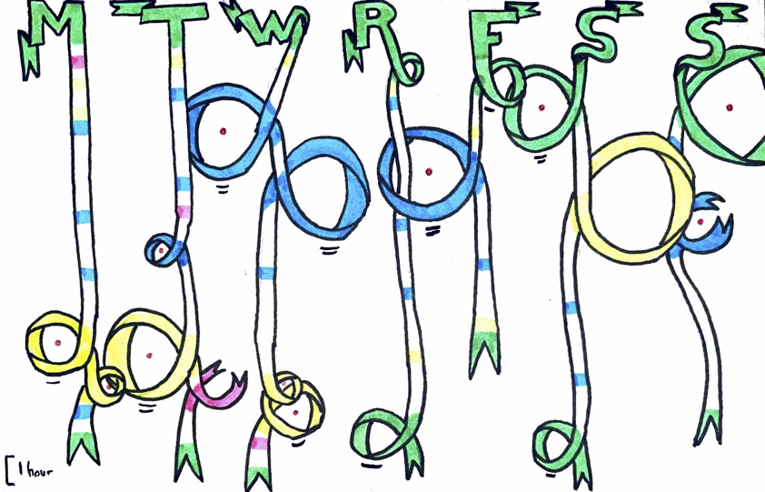

Matteo’s Dear Data
================
Matteo Larrode (@matteoStats)

## Data Wrangling

I cleaned and simplified the data I had collected throughout the week.

``` r
library(tidyverse)
library(janitor)

my_procras <- readr::read_csv("dataset.csv") %>%
  clean_names()
```

I then cleaned the data: </br>

- grouped some tasks </br>

- binned procrastination times into categories

``` r
# group some tasks to simplify visualization & bin procrastination times into 5 categories
my_procras_final <- my_procras %>%
  mutate(task = case_when(task %in% c("cook", "tidy") ~ "chores", 
                          task %in% c("career", "admin")~ "admin+",
                          TRUE ~ task))%>%
  mutate(procrastinat_bin = cut(procrastinat,
                                breaks = c(0, 1, 30, 60, 120, 200),
                                right = FALSE,
                                labels = c("None", "<30", "<60", "<120", "120+")))
```

Here is a glance at the final table I worked with:

    # A tibble: 51 × 5
       day       time   task       social procrastinat_bin
       <chr>     <time> <chr>       <dbl> <fct>           
     1 Monday    10:00  out_bed         0 None            
     2 Monday    10:30  admin+          0 None            
     3 Monday    10:45  chores          0 None            
     4 Monday    12:15  chores          0 None            
     5 Monday    12:45  work            0 None            
     6 Monday    15:30  work            0 None            
     7 Monday    17:10  work            0 None            
     8 Monday    21:30  chores          1 <60             
     9 Monday    22:45  chores          1 <30             
    10 Monday    23:30  work            0 None            
    11 Tuesday   01:30  lights_off      0 None            
    12 Tuesday   08:00  out_bed         0 None            
    13 Tuesday   08:30  chores          0 None            
    14 Tuesday   09:30  work            0 None            
    15 Tuesday   13:00  work            0 None            
    16 Tuesday   14:15  admin+          0 None            
    17 Tuesday   16:00  work            1 <30             
    18 Tuesday   20:00  chores          1 <120            
    19 Tuesday   22:00  admin+          0 <NA>            
    20 Wednesday 01:30  lights_off      0 None            
    # … with 31 more rows

## Visualization

</br>

------------------------------------------------------------------------

 </br>

## Explanation of the graph

Space at the back of the card is quite limited so here is a more
detailed explanation of the visualization.

#### 1) Representation of time

Time is represented as a ribbon: 1 hour = 7mm.</br>

Every day is a distinct ribbon that starts when I wake up and ends when
I turn my lights off and decide to fall asleep.

<p>
*Note: Sleep separates days of the week here, not time. Therefore,
procrastination that occurs before going to sleep, even past midnight is
counted as part of the previous day.*
</p>

#### 2) Tasks

Throughout the day, I have counted and represented the moment I decide
that I need to start a task. Here is the list of the tasks and colors
used to represent them.

| Task                                                                          | Colour |
|-------------------------------------------------------------------------------|--------|
| Get out of bed (morning) / Lights off (night)                                 | Green  |
| Work or study                                                                 | Blue   |
| Cook or tidy up                                                               | Yellow |
| Administrative task or work on career (e.g. email, application, cover letter) | Pink   |

<p>
When the task is started straight away, it is represented as a simple
line on the ribbon. However, when it postponed, the ribbon takes its
colour.
</p>

#### 3) Procrastination

<p>

To represent time lost during the day to procrastination, I chose to
represent it as a knot in the time ribbon. The knot starts at the time I
decided to start the task, and ends when I finally started the task.
Therefore, the ribbon is shortened by procrastination: if one hour is
spent procrastinating, it is an hour that will NOT be represented by the
ribbon.

</p

<p>

There are five types of knots: </br>

- 5mm diameter: procrastinated for LESS THAN 30mn </br>

- 10mm diameter: procrastinated for more than 30mn but less than an hour
  </br>

- 20mm diameter: procrastinated for more than an hour but less than two
  hours </br>

- 30mm diameter: procrastinated for more than two hours</br>

- open: did not start the task during the day

  </p>

<p>
I wanted to represent procrastination in a negative light, as a time
waster that shortens my days. Knots represent procrastination exactly
how I wanted because they actually shorten the ribbon that represent my
time of activity during the day. However, procrastination can seen in
another, more positive, light. It is a way to relax and maybe make my
‘active’ time more productive. This positive side is not represented in
this graph.
</p>

#### 4) Social media

<p>
Knots represented with a red dot mean that the procrastination time they
represent has been spent on social media for the most part.
</p>

## Findings

Here are some findings of this week of data collection.

#### 1) Intensity of procrastination

The week seems to be divided in two parts. Knots become larger and more
numerous from Monday through Wednesday. Then, Thursday has very little
procrastination, similarly to Monday. And, in a similar fashion as
during the start of the week, procrastination gradually increases again,
with a peak on the weekend.

#### 2) Tasks procrastinated

The nature of tasks delayed by procrastination changes throughout the
week. During the week-end, the biggest difficulty is clearly to get out
of bed! A common occurrence throughout the week is that social networks
are a major factor in my procrastination.
