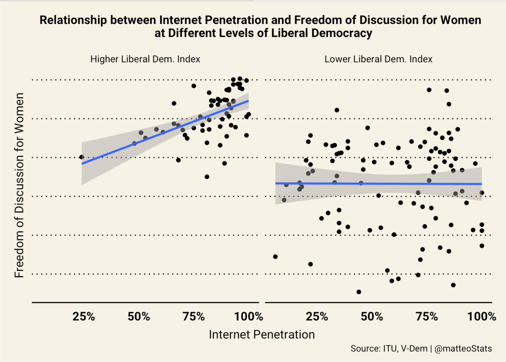

# Executive Summary

Will be written depending on the conclusions I reach.

# Introduction

A growing body of literature is interested in the effect of the rise and diffusion of new technologies on international relations. One particular topic I am interested in is the relationship between internet use, especially activity on social networks, and freedom of speech. Social media platforms have fundamentally transformed the landscape of social and political movements. They have allowed individuals to bypass traditional gatekeepers of information, such as the mainstream media, and connect with each other directly. This has enabled dissidents to spread information and organize more quickly and effectively than ever before. But on the other hand, they can also be easily monitored and censored by governments, potentially putting activists at risk. In this report, I will be looking at the relationship between access to the Internet, as a proxy for access to social media, and civil liberties. I will compare and contrast different forms of governance, and focus on gender inequalities.

# Dataset & Methodology

I created a dataset called "final_data.csv" by joining data on Internet penetration, provided by the International Telecommunication Union (ITU) (percentage of the population who has access to the internet), and around 50 different metrics used by V-Dem to measure levels of democracy. This data is available for a total of 157 countries.

[Add explanation about data on gender]

# Findings

## I) General Findings

**Main research question**: "Does higher Internet penetration lead to higher levels of freedom of speech?" More specifically, could the Internet empower people who are usually less able to express themselves to finally share their opinions?

**Choice of variables**:

-   Main Dependent Variable: Freedom of speech
-   Main Independent Variable: Access to the Internet
-   Other Independent Variables:
    -   Level of democracy (VDem)
    -   Access to the Internet by gender

Here is a scatterplot that illustrates the relationship between freedom of discussion for women, my outcome variable, and access to the Internet, my main independent variable. Note that the graph is faceted by different levels of the VDem liberal democracy index.

 The main objective of the report is to uncover the nature of the interaction between governance and the effect of Internet penetration on freedom of speech, using exploratory data analysis and data visualization.

## II) In Democracies: The Internet & Social Media as a Promoter of Civil Liberties

Hypothesis 1: In democracies, institutions and rules that govern the use of the Internet are such that it can be used freely by citizens to share their opinion and organize offline action in a safe environment.

### i- A Platform to Share Opinions and Speak Out in Safety 

Hypothesis 1.1: Democracies with more access to the Internet will display higher levels of freedom of speech.

### ii- A Platform to Organize Offline Action

Hypothesis 1.2: Democracies with more access to the Internet will display higher levels of offline activism.

### iii- Limitations: Dangers of Social Media to Democracy

## III) In Autocracies: The Internet as a Tool of Repression

Hypothesis 2: Autocratic regimes can manipulate the quantity and content of the information that flows on the Internet locally. They can also use it to monitor activism on social media and target journalists and activists more easily.

### i- Censorship & Disinformation → nature of the information

Hypothesis 2.1: Autocracies with more access to the Internet will not display higher levels of freedom of speech because of the regimes of censorship they impose, and will even display higher levels of disinformation that autocracies with less access to the Internet.

### ii- Surveillance & violence → use of the information

Hypothesis 2.2: Autocracies with more access to the Internet will display higher levels of monitoring and targeted violence than those with lower access to the Internet.

### iii- Optimism: the Power of the Internet for Social Change

Hypothesis 2.3: Autocracies with more access to the Internet will display higher levels of use of social media for offline action.

# Research Conclusions

This report will uncover the phenomena and mechanisms behind the difference in the relationship between access to the Internet and freedom of discussion among different types of governance. Using both regression analysis, and exploratory data analysis, each hypothesis mentioned in this outline will be tested.
