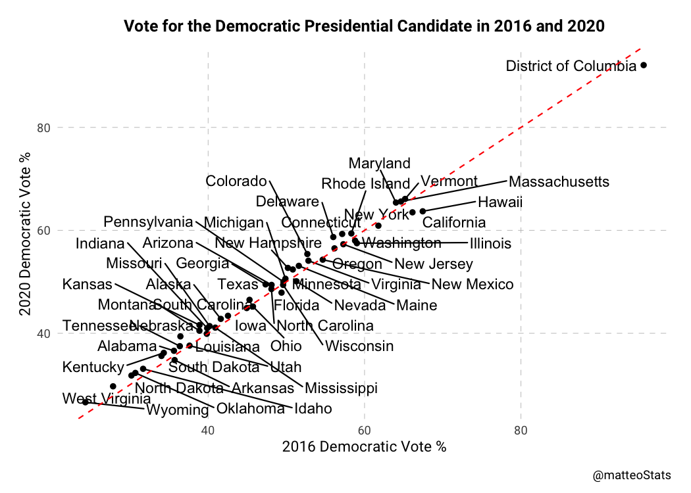
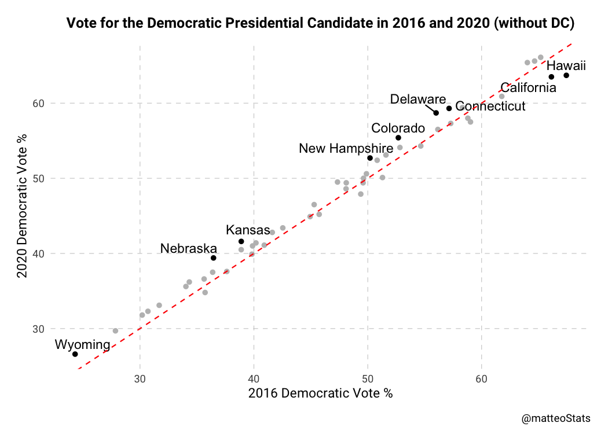
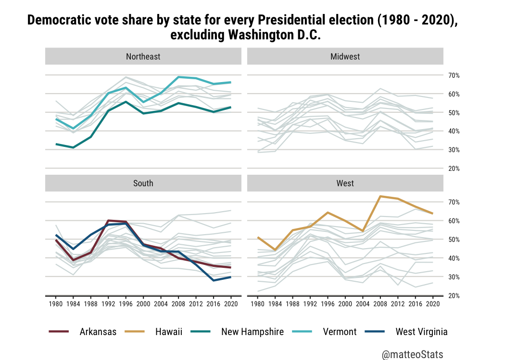

Assignment \#5 - Graphing Realtionships
================
Matteo Larrode

<script src="README_files/libs/kePrint-0.0.1/kePrint.js"></script>
<link href="README_files/libs/lightable-0.0.1/lightable.css" rel="stylesheet" />


## Question 1: 2016 and 2020 Democratic vote shares

Let’s first load the packages and data we will need for this assignment

<details>
<summary>Code</summary>

``` r
library(tidyverse)
library(haven)
library(kableExtra) #table
library(psych) #describe function
library(ggplot2)
library(ggthemes)
library(ggrepel) #labeling state names
library(scales)

vote_2020 <- read_csv("data/us_vote_2020.csv")
dem_share_80_16 <- read_dta("data/leipvote1980_2016wide.dta")
```

</details>

Now I join the 2020 election data to democratic votes shares of the two
party vote, from 1980 to 2016 to the 1980-2016.

<details>
<summary>Code</summary>

``` r
vote_80_20 <- left_join(dem_share_80_16, vote_2020, by = "state") %>%
  mutate(pctdem2020 = dem_percent / 100)

vote16_20 <- vote_80_20 %>%
  select(state, stateid, pctdem2016, pctdem2020)
```

</details>

Here is a table of summary statistics for the 2016 and 2020 Democratic
vote shares.

<details>
<summary>Code</summary>

``` r
summary_stats <- describe(vote16_20[ , c('pctdem2016', 'pctdem2020')], fast = TRUE) %>%
  as.data.frame() %>%
  select(-vars) %>%
  mutate(across(-n, ~ . * 100))
  
rownames(summary_stats) <- c("2016", "2020")

# Create HTML table
table1 <- kbl(summary_stats, format = "html", align = "c", caption = "Summary Statistics for Democratic Vote Shares (2016-2020)") %>%
  kable_styling(bootstrap_options = c("striped", "hover"), 
                full_width = F,
                fixed_thead = T)

table1
```

</details>
<table class="table table-striped table-hover" style="width: auto !important; margin-left: auto; margin-right: auto;">
<caption>Summary Statistics for Democratic Vote Shares (2016-2020)</caption>
 <thead>
  <tr>
   <th style="text-align:left;position: sticky; top:0; background-color: #FFFFFF;">   </th>
   <th style="text-align:center;position: sticky; top:0; background-color: #FFFFFF;"> n </th>
   <th style="text-align:center;position: sticky; top:0; background-color: #FFFFFF;"> mean </th>
   <th style="text-align:center;position: sticky; top:0; background-color: #FFFFFF;"> sd </th>
   <th style="text-align:center;position: sticky; top:0; background-color: #FFFFFF;"> min </th>
   <th style="text-align:center;position: sticky; top:0; background-color: #FFFFFF;"> max </th>
   <th style="text-align:center;position: sticky; top:0; background-color: #FFFFFF;"> range </th>
   <th style="text-align:center;position: sticky; top:0; background-color: #FFFFFF;"> se </th>
  </tr>
 </thead>
<tbody>
  <tr>
   <td style="text-align:left;"> 2016 </td>
   <td style="text-align:center;"> 51 </td>
   <td style="text-align:center;"> 47.98565 </td>
   <td style="text-align:center;"> 12.80435 </td>
   <td style="text-align:center;"> 24.29761 </td>
   <td style="text-align:center;"> 95.69247 </td>
   <td style="text-align:center;"> 71.39486 </td>
   <td style="text-align:center;"> 1.792967 </td>
  </tr>
  <tr>
   <td style="text-align:left;"> 2020 </td>
   <td style="text-align:center;"> 51 </td>
   <td style="text-align:center;"> 48.64706 </td>
   <td style="text-align:center;"> 12.03574 </td>
   <td style="text-align:center;"> 26.60000 </td>
   <td style="text-align:center;"> 92.10000 </td>
   <td style="text-align:center;"> 65.50000 </td>
   <td style="text-align:center;"> 1.685340 </td>
  </tr>
</tbody>
</table>

We can see that there was a slight increase, on average, in the
percentage of the two-party vote that went to the Democratic
presidential candidate from 2016 to 2020. The mean percentage increased
from 47.99% in 2016 to 48.65% in 2020, and the minimum percentage
increased too. The standard deviation and range decreased as well,
suggesting that there was slightly less variability in the percentage of
the two-party vote that went to the Democratic presidential candidate
across all states in 2020 compared to 2016.

## Question 2: Scatter plot

Now let us generate the vote swing scatter plot with the 2020 Democratic
percentage of the vote on the Y axis and the 2016 Democratic percentage
of the vote on the X axis.

<details>
<summary>Code</summary>

``` r
plot1 <- ggplot(vote16_20, aes(x = pctdem2016*100, y = pctdem2020*100)) +
  geom_point() +
  geom_text_repel(aes(label = state),
                  max.overlaps = Inf) +
  theme(text=element_text(family="Roboto"),
        panel.background = element_blank(),
        plot.margin = unit(c(0, 0.5, 0.5, 0.5), "cm"),
        plot.title=element_text(hjust=0.5, face="bold", size=12, margin = margin(b=10)),
        plot.caption = element_text(size=9, vjust = -2),
        axis.ticks = element_blank(),
        panel.grid.major = element_line(color = "gray", linetype = "dashed", linewidth = 0.2))+
  labs(x = "2016 Democratic Vote %", 
       y = "2020 Democratic Vote %",
       title = "Vote for the Democratic Presidential Candidate in 2016 and 2020",
       caption = "@matteoStats") + # axis labels
  geom_abline(intercept = 0, slope = 1, linetype = "dashed", color = "red") # add 45 degree line


plot1
```

</details>



Even using the {ggrepel} package to label state names, the plot is too
crowded! In order to be able to read and describe the graph, let us try
labeling only 10 states. To bring more insight on states that
experienced change, I will choose those with the highest difference
between 2016 and 2020.

<details>
<summary>Code</summary>

``` r
vote16_20_new <- vote16_20 %>%
  mutate(pct_diff = abs(pctdem2020 - pctdem2016),
         #use rank function
         top_10 = ifelse(rank(desc(pct_diff)) <= 10, TRUE, FALSE))
```

</details>

Now let us plot the new graph, with less state labels.

<details>
<summary>Code</summary>

``` r
plot2 <- ggplot(vote16_20_new, aes(x = pctdem2016*100, y = pctdem2020*100, col = top_10)) +
  geom_point() +
  geom_text_repel(data = filter(vote16_20_new, top_10),
                  aes(label = state),
                  #get labels away from the points
                  position = position_nudge_repel(y = 1)) +
  theme(text=element_text(family="Roboto"),
        panel.background = element_blank(),
        plot.margin = unit(c(0, 0.5, 0.5, 0.5), "cm"),
        plot.title=element_text(hjust=0.5, face="bold", size=12, margin = margin(b=10)),
        plot.caption = element_text(size=9, vjust = -2),
        axis.ticks = element_blank(),
        panel.grid.major = element_line(color = "gray", linetype = "dashed", linewidth = 0.2),
        legend.position = "none")+
  scale_color_manual(values = c("grey", "black"))+
  labs(x = "2016 Democratic Vote %", 
       y = "2020 Democratic Vote %",
       title = "Vote for the Democratic Presidential Candidate in 2016 and 2020",
       caption = "@matteoStats") + # axis labels
  geom_abline(intercept = 0, slope = 1, linetype = "dashed", color = "red") # add 45 degree line


plot2
```

</details>


The points above the 45-degree line indicate a gain in Democratic votes
between 2016 and 2020, while points below the line indicate a loss in
Democratic votes. From the plot, we can see that most states had a
higher percentage of Democratic votes in 2020 compared to 2016, as
indicated by the majority of points above the 45-degree line. Some
notable exceptions include California, and Hawaii, where the Democratic
vote share decreased from 2016 to 2020.

The choice of states to label does leave out some information. For
example, it is interesting to note that some traditionally Republican
states, such as Arizona and Georgia, had a significant gain in
Democratic votes in 2020. Overall, this plot provides a useful visual
representation of the changing political landscape in the United States
between the 2016 and 2020 presidential elections.

At the top-right corner of the plot, the state of Washington, D.C. seems
like an outlier. For both 2016 and 2020, it has a much higher percentage
of vote for the Democrat candidate than the other states. Let us try to
omit this state for the next plot.

<details>
<summary>Code</summary>

``` r
plot3 <- ggplot(data = filter(vote16_20_new, state != "District of Columbia"),
                aes(x = pctdem2016*100, y = pctdem2020*100, col = top_10)) +
  geom_point() +
  geom_text_repel(data = filter(vote16_20_new, top_10 & state != "District of Columbia"),
                  aes(label = state),
                  #get labels away from the points
                  position = position_nudge_repel(y = 1)) +
  theme(text=element_text(family="Roboto"),
        panel.background = element_blank(),
        plot.margin = unit(c(0, 0.5, 0.5, 0.5), "cm"),
        plot.title=element_text(hjust=0.5, face="bold", size=12, margin = margin(b=10)),
        plot.caption = element_text(size=9, vjust = -2),
        axis.ticks = element_blank(),
        panel.grid.major = element_line(color = "gray", linetype = "dashed", linewidth = 0.2),
        legend.position = "none")+
  scale_color_manual(values = c("grey", "black"))+
  labs(x = "2016 Democratic Vote %", 
       y = "2020 Democratic Vote %",
       title = "Vote for the Democratic Presidential Candidate in 2016 and 2020 (without DC)",
       caption = "@matteoStats") + # axis labels
  geom_abline(intercept = 0, slope = 1, linetype = "dashed", color = "red") # add 45 degree line


plot3
```

</details>



The effect of removing Washington D.C. is that the points of the scatter
plot are less tightly clustered. Removing the outlier - DC - helps to
get a clearer view of the evolution of the vote for the Democrat
candidate between 2016 and 2020 in the other states.

## Question 3

From our data on democratic vote from 1980 to 2020, we filter out
Washington D.C., and reshape the data from wide form to long form.

<details>
<summary>Code</summary>

``` r
vote_80_20_new <- vote_80_20 %>%
  filter(state != "District of Columbia") %>%
  pivot_longer(cols = starts_with("pctdem"), 
               names_to = "Year", 
               values_to = "vote_pct")%>%
  select(state, stateid, Year, vote_pct)%>%
  mutate(Year = str_extract(Year, "\\d{4}")) %>%
  print(n = 15)
```

</details>

    # A tibble: 550 × 4
       state   stateid Year  vote_pct
       <chr>   <chr>   <chr>    <dbl>
     1 Alabama AL      1980     0.493
     2 Alabama AL      1984     0.387
     3 Alabama AL      1988     0.403
     4 Alabama AL      1992     0.462
     5 Alabama AL      1996     0.463
     6 Alabama AL      2000     0.424
     7 Alabama AL      2004     0.371
     8 Alabama AL      2008     0.391
     9 Alabama AL      2012     0.388
    10 Alabama AL      2016     0.356
    11 Alabama AL      2020     0.366
    12 Alaska  AK      1980     0.327
    13 Alaska  AK      1984     0.309
    14 Alaska  AK      1988     0.378
    15 Alaska  AK      1992     0.434
    # ℹ 535 more rows

Now, we can generate a line plot for the 50 states from 1980 to 2020,
graphing percent Democratic on the y-axis and year on the x-axis. To
bring more insight, we will emphasize the 5 states with the highest
variation, using standard deviation.

A bit of setup is necessary first.

<details>
<summary>Code</summary>

``` r
#selection of the colors for highlighted lines
highlight_colors <- c("#17648d", "#51bec7","#008c8f","#d6ab63", "#843844")

#find the highest and lowest averages
state_sd <- vote_80_20_new %>%
  group_by(state)%>%
  summarize(sd = sd(vote_pct))

#selection of 6 states
names(highlight_colors) <- c('West Virginia', 
                             'Vermont', 
                             'New Hampshire',
                             'Hawaii',
                             'Arkansas')


#new data frame with only those 5 focus areas
highlight_data <- vote_80_20_new %>%
  filter(state %in% names(highlight_colors))
```

</details>

Now on to the plotting!

<details>
<summary>Code</summary>

``` r
plot4 <- ggplot(vote_80_20_new, aes(x = Year, y = vote_pct, group = state)) +
  geom_line(linewidth = 0.75, color = '#d4dddd') +
  geom_line(data = highlight_data, aes(color = state), linewidth = 1.25) + 
  
  labs(title = "Democratic vote share by state for every Presidential election (1980 - 2020), \n excluding Washington D.C.",
       caption = "@matteoStats",
       x = NULL,
       y = NULL)+
  
  scale_y_continuous(position = "right",
                     labels = scales::percent_format())+
  scale_colour_manual(values = highlight_colors) + 
  
  theme(aspect.ratio = 3.2/6,
        text = element_text(family = "Roboto Condensed"),
        plot.margin = margin(t = 0, r = 0.75, b = 0, l = 0.75, unit = "cm"),
        plot.background = element_rect(fill = "white"),
        panel.background = element_rect(fill = "white"),
        panel.grid.major.x = element_blank(),
        panel.grid.minor.x = element_blank(),
        panel.grid.major.y = element_line(color = "#dcdbd8"),
        panel.grid.minor.y = element_blank(),
        legend.text = element_text(margin = margin(l=3), size = 10),
        legend.title = element_blank(),
        legend.position = c(0.15, 0.9),
        legend.key.width = unit(25,"pt"),
        legend.key.height = unit(15, "pt"),
        legend.key = element_blank(),
        axis.text = element_text(size = 9, color = "gray8"),
        axis.line.x  = element_line(color = "gray8"),
        axis.ticks.y = element_blank(),
        plot.title = element_text(size = 14, hjust = 0.5, face = "bold"),
        plot.caption = element_text(hjust = 1, size = 11, colour = "#4B4B4B"))

plot4
```

</details>


Many lines in the plot seem to generally show a gradual increase in the
percentage of Democratic voters over time; however, this does not
necessarily mean that voting is becoming more Democratic. In fact, the
data could suggest a growing polarization between Democratic and
Republican voters. This is particularly evident when observing the
widening of the spread of Democratic vote share over the years, at the
national level.

There are some notable spikes and dips in the lines, indicating abrupt
changes in voting patterns. For example, many states experienced an
important increase in Democratic voters in the 1990s, and a subsequent
decrease at the turn of the millennium.

The lines for each state are generally quite flat, indicating that the
percentage of Democratic voters does not vary greatly within states over
time, with some states that consistently vote more, or less, Democratic
others.

This leads me to the story told by my choice to highlight the states
with the highest standard deviation in democratic voting share. A state
with a high standard deviation indicates that it experiences more
variability in the percentage of Democratic voters across time, compared
to states with lower standard deviations. Those highlighted states go
through noteworthy changes in demographics or political attitudes over
time, leading to more variability in the percentage of Democratic
voters. Identifying those states is especially important in the United
States, due to its voting system. States with high standard deviation
are potentially more competitive in elections, with voters more likely
to switch between Democratic and Republican candidates, having major
implications for election strategies and the allocation of campaign
resources by political parties.

Now let’s try faceting the graph by census region.

<details>
<summary>Code</summary>

``` r
#install.packages("usa")
library(usa)
```

</details>

    The 'usa' package masks the state datasets included in base R:
    * state.abb
    * state.area
    * state.center
    * state.division
    * state.name
    * state.region
    Objects are similar in class and content but updated and expanded.


    Attaching package: 'usa'

    The following objects are masked from 'package:datasets':

        state.abb, state.area, state.center, state.division, state.name,
        state.region

<details>
<summary>Code</summary>

``` r
usa_region <- usa::states %>%
  select(name, region)

#attach census region to dataset
vote_80_20_new <- left_join(vote_80_20_new, usa_region, by = c("state" = "name"))

highlight_data <- vote_80_20_new %>%
  filter(state %in% names(highlight_colors))

#plot
plot5 <- ggplot(vote_80_20_new, aes(x = Year, y = vote_pct, group = state)) +
  geom_line(linewidth = 0.5, color = '#d4dddd') +
  geom_line(data = highlight_data, aes(color = state), linewidth = 1) + 
  
  labs(title = "Democratic vote share by state for every Presidential election (1980 - 2020), \n excluding Washington D.C.",
       caption = "@matteoStats",
       x = NULL,
       y = NULL)+
  
  scale_y_continuous(position = "right",
                     labels = scales::percent_format())+
  scale_colour_manual(values = highlight_colors) + 
  
  facet_wrap(~ region, ncol=2) +

  
  theme(aspect.ratio = 3.2/6,
        text = element_text(family = "Roboto Condensed"),
        plot.margin = margin(t = 0, r = 0.5, b = 0, l = 0.5, unit = "cm"),
        plot.background = element_rect(fill = "white"),
        panel.background = element_rect(fill = "white"),
        panel.grid.major.x = element_blank(),
        panel.grid.minor.x = element_blank(),
        panel.grid.major.y = element_line(color = "#dcdbd8"),
        panel.grid.minor.y = element_blank(),
        legend.text = element_text(margin = margin(l=3), size = 10),
        legend.title = element_blank(),
        legend.position = "bottom",
        legend.key.width = unit(25,"pt"),
        legend.key.height = unit(15, "pt"),
        legend.key = element_blank(),
        axis.text = element_text(size = 7, color = "gray8"),
        axis.line.x  = element_line(color = "gray8"),
        axis.ticks.y = element_blank(),
        plot.title = element_text(size = 14, hjust = 0.5, face = "bold"),
        plot.caption = element_text(hjust = 1, size = 11, colour = "#4B4B4B"))

plot5
```

</details>



Overall, this faceted graph suggests that regional differences play an
important role in shaping the political landscape of the United States.
The Northeast and West regions tend to vote more for Democrat
presidential candidates than the Midwest and South regions.
Additionally, the chart indicates that the percentage of Democratic
voters has been relatively stable in some regions while it has
fluctuated more in others (e.g., West).

## Question 4: Final Project Data

I am passionate about both political science and technology, so I grew
interested in the effect of the rise and diffusion of new technologies
on international relations. One particular topic that fascinates me is
the relationship between internet use, especially activity on social
networks, and freedom of speech.

Social media platforms have fundamentally transformed the landscape of
social and political movements. They have allowed individuals to bypass
traditional gatekeepers of information, such as the mainstream media,
and connect with each other directly. This has enabled dissidents to
spread information and organize more quickly and effectively than ever
before. But on the other hand, they can also be easily monitored and
censored by governments, potentially putting activists at risk.

I created a dataset called “final_data.csv” by joining data on Internet
penetration, provided by the [International Telecommunication Union
(ITU)](https://www.itu.int/en/ITU-D/Statistics/Pages/stat/default.aspx),
and around 50 different metrics used by
[V-Dem](https://www.v-dem.net/data/the-v-dem-dataset/) to measure levels
of democracy.

<details>
<summary>Code</summary>

``` r
df <- read_csv("data/final_data.csv")%>% 
  drop_na()
```

</details>

    Rows: 202 Columns: 52
    ── Column specification ────────────────────────────────────────────────────────
    Delimiter: ","
    chr  (2): Economy, country_text_id
    dbl (50): value_2021, value_2021_perc, country_id, year, v2x_libdem, v2x_ega...

    ℹ Use `spec()` to retrieve the full column specification for this data.
    ℹ Specify the column types or set `show_col_types = FALSE` to quiet this message.

<details>
<summary>Code</summary>

``` r
df_reduced <- df %>% 
  select(Economy, value_2021_perc, v2x_libdem, v2cldiscm, v2cldiscw)%>%
  mutate(is_dem = v2x_libdem >= 0.5,
         is_dem_long = ifelse(is_dem, "Higher Liberal Dem. Index", "Lower Liberal Dem. Index"))


head(df_reduced)
```

</details>

    # A tibble: 6 × 7
      Economy   value_2021_perc v2x_libdem v2cldiscm v2cldiscw is_dem is_dem_long   
      <chr>               <dbl>      <dbl>     <dbl>     <dbl> <lgl>  <chr>         
    1 Albania              0.79      0.41      1.74      1.63  FALSE  Lower Liberal…
    2 Algeria              0.71      0.138     0.436     0.097 FALSE  Lower Liberal…
    3 Angola               0.33      0.168     0.504     0.356 FALSE  Lower Liberal…
    4 Argentina            0.87      0.657     2.62      2.46  TRUE   Higher Libera…
    5 Armenia              0.79      0.541     2.11      1.70  TRUE   Higher Libera…
    6 Australia            0.96      0.804     2.40      2.80  TRUE   Higher Libera…

My main research question is: “Does higher Internet penetration lead to
high levels of freedom of speech?”

More specifically, could the Internet empower people who are usually
less able to express themselves to finally share their opinions? Here is
a scatterplot that illustrates the relationship between freedom of
discussion for women, my outcome variable, and access to the Internet,
my main independent variable?

<details>
<summary>Code</summary>

``` r
free_disc_women_plot <- ggplot(df_reduced, aes(x = value_2021_perc, y = v2cldiscw))+
  geom_point()+
  geom_smooth(method = "lm")+
  
  theme_wsj(title_family = "Roboto")+
  theme(text=element_text(family="Roboto"),
        plot.title=element_text(hjust=0.5, face="bold", size=12, margin = margin(b=10)),
        plot.caption = element_text(size=9, vjust = -2),
        axis.title = element_text(size = 12),
        axis.title.x = element_text(vjust = -2),
        axis.text.x = element_text(vjust = -.5),
        axis.text.y = element_blank(),
        axis.ticks.x = element_blank())+
  scale_x_continuous(name ="Internet Penetration",labels = scales::percent_format(accuracy = 1))+
  scale_y_continuous(name = "Freedom of Discussion for Women")+
  labs(title = "Higher Access to the Internet is Correlated with More Freedom of Discussion for Women",
       caption="Source: ITU, V-Dem | @matteoStats")

free_disc_women_plot
```

</details>

    `geom_smooth()` using formula = 'y ~ x'


From this simple scatterplot, and the linear regression fitted to the
data, it seems that countries with high levels of Internet penetration
are associated with high levels of freedom of discussion for women.
However, an important omitted variable bias could emerge if we do not
take governance into account. Indeed, democracies, usually characterized
by high levels of freedom of discussion, are also often more developed
than authoritarian regimes, and therefore have higher Internet
penetration rates on average.

An interesting extra step to analyze the relationship between Internet
penetration and freedom of discussion could be to control for the level
of democracy. To reach this objective, we will use V-Dem’s Liberal
democracy index (v2x_libdem), that measures to what extent is the ideal
of liberal democracy achieved. To clarify, the liberal principle of
democracy emphasizes the importance of protecting individual and
minority rights against the tyranny of the state and the tyranny of the
majority. This is achieved by constitutionally protected civil
liberties, strong rule of law, an independent judiciary, and effective
checks and balances that, together, limit the exercise of executive
power.

To explore this addition of an independent variable to the model, we can
create the same scatterplot as before, but faceted by different levels
of the liberal democracy index. There is no specific threshold level at
which a country is considered a democracy on the V-Dem index. Rather,
the index measures the extent to which a country meets the various
criteria for democracy and assigns a score accordingly. The higher the
score, the more democratic the country is considered to be. However, for
the purpose of this graph, I arbitrarily decided of a threshold (0.5) to
separate countries into two categories of liberal democracy.

<details>
<summary>Code</summary>

``` r
free_disc_women_plot2 <- ggplot(df_reduced, aes(x = value_2021_perc, y = v2cldiscw))+
  geom_point()+
  geom_smooth(method = "lm")+
  
  facet_wrap(~ is_dem_long, ncol=2) +
  
  theme_wsj(title_family = "Roboto")+
  theme(text=element_text(family="Roboto"),
        plot.title=element_text(hjust=0.5, face="bold", size=12, margin = margin(b=10)),
        plot.caption = element_text(size=9, vjust = -2),
        axis.title = element_text(size = 12),
        axis.title.x = element_text(vjust = -2),
        axis.text.x = element_text(vjust = -.5),
        axis.text.y = element_blank(),
        axis.ticks.x = element_blank())+
  scale_x_continuous(name ="Internet Penetration",labels = scales::percent_format(accuracy = 1))+
  scale_y_continuous(name = "Freedom of Discussion for Women")+
  labs(title = "Relationship between Internet Penetration and Freedom of Discussion for Women \n at Different Levels of Liberal Democracy",
       caption="Source: ITU, V-Dem | @matteoStats")

free_disc_women_plot2
```

</details>

    `geom_smooth()` using formula = 'y ~ x'


This faceted graph gives some very interesting information! It suggests
that the effect of Internet penetration on freedom of discussion for
women is *conditional on the level of libertarian democracy*. In
countries considered to be more democratic, higher access to the
Internet seems to be correlated to an increase in the freedom of
discussion for women. On the other hand, countries classified as having
a lower liberal democracy index do not display an apparent relationship
between Internet penetration and freedom of discussion for women.
