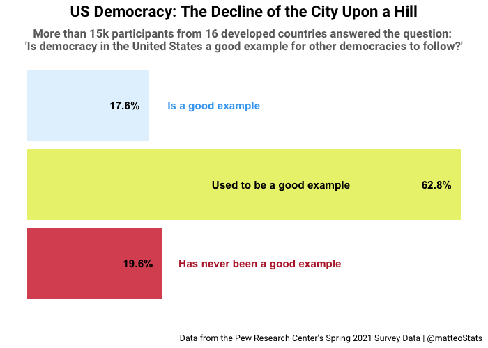
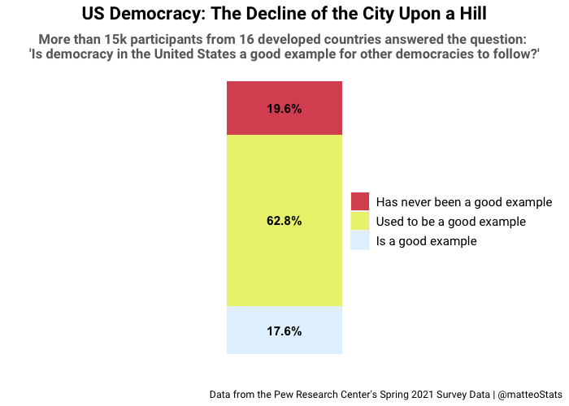
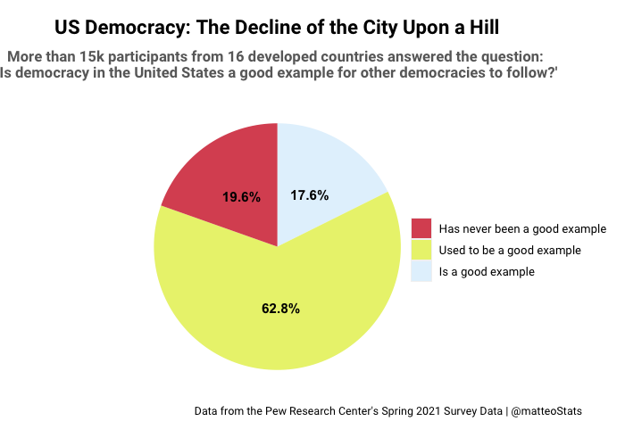
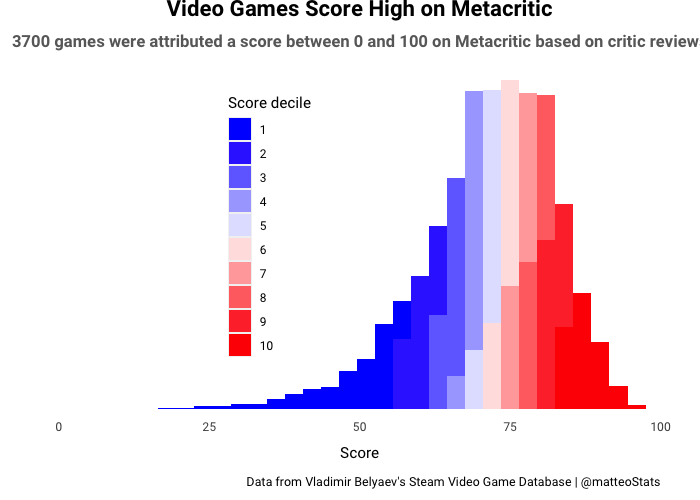
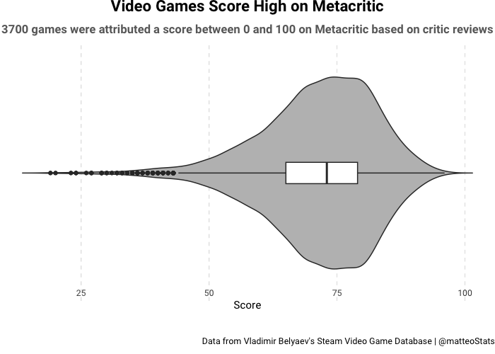
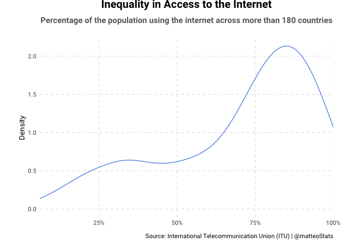
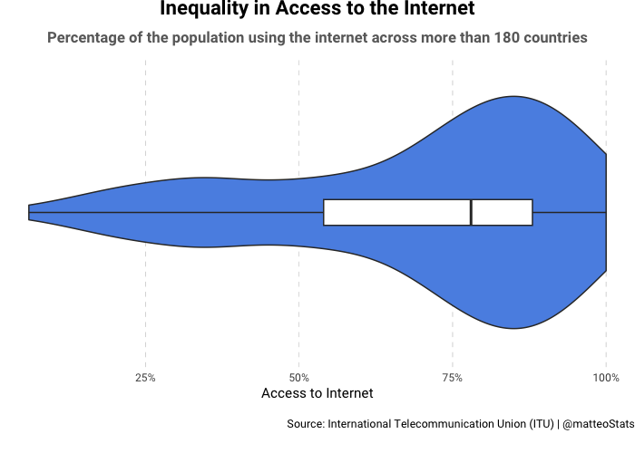
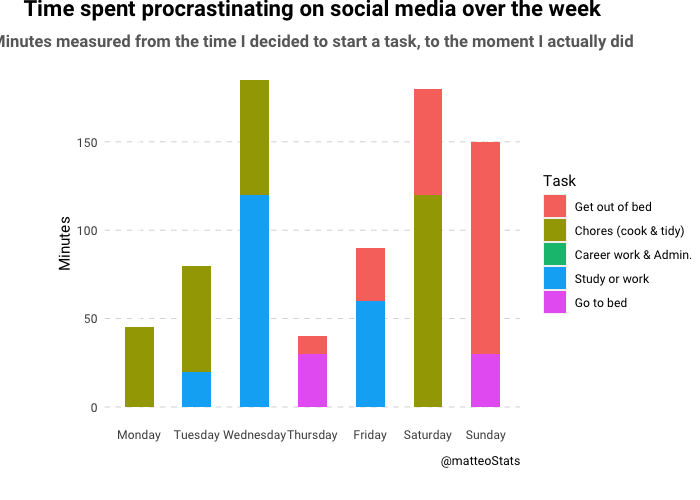

Graphing single variables \[Assignment \#3\]
================
Matteo Larrode

# Question 1 - Comparing chart types

## Variable \#1: Categorical variable - Opinion on US Democracy

The first variable is extracted from the Pew Research Center’s *Global
Attitudes & Trends Spring 2021 Questionnaire*. People from a diversity
of developed countries[^1] answered a questionnaire about their opinion
on many topics including politics, the economy, and healthcare among
others.

One question of the survey asks: “Which statement comes closest to your
view, even if none are exactly right? Democracy in the United States…
</br> - (1) IS a good example for other countries to follow</br> - (2)
USED TO BE a good example, but has not been in recent years </br> - (3)
HAS NEVER BEEN a good example for other countries to follow</br>

The variable is a categorical variable. And even though it is
constituted of numbers, they are used to represent categories, so
mathematical operations should not be performed on them.

First, let us load the data and isolate our variable of interest.
Participants who were either undecided or refused to answer are also
removed.

<details>
<summary>Code</summary>

``` r
library(haven)
library(tidyverse)

dataset <- read_sav("data/Pew_GlobalAttitudes_Spring2021.sav")

us_dem_example <- dataset %>%
  select(ID, USDEMOCRACY_EXAMPLE) %>%
  filter(USDEMOCRACY_EXAMPLE<7)
```

</details>

Before anything else, a bit of transformation is necessary. We need to
group each satisfaction level and count them. I also added a variable
that displays the proportion of each level as a percentage. You will
also note the “place” variable; it is used to place the labels in the
chart.

<details>
<summary>Code</summary>

``` r
us_dem_example_grouped <- us_dem_example %>%
  mutate(USDEMOCRACY_EXAMPLE = as.character(USDEMOCRACY_EXAMPLE))%>%
  group_by(USDEMOCRACY_EXAMPLE)%>%
  summarise(value = n())%>%
  mutate(perc = scales::percent(value / sum(value), accuracy = .1, trim = FALSE),
         USDEMOCRACY_EXAMPLE_LONG = recode(USDEMOCRACY_EXAMPLE, 
                                           '1'='Is a good example', 
                                           '2'='Used to be a good example', 
                                           '3'='Has never been a good example'),
         USDEMOCRACY_EXAMPLE_LONG = factor(USDEMOCRACY_EXAMPLE_LONG, 
                                           levels = c("Has never been a good example",
                                                      "Used to be a good example",
                                                      "Is a good example")),
         place = case_when(USDEMOCRACY_EXAMPLE == '1' ~ -0.2,
                           USDEMOCRACY_EXAMPLE == '2' ~ 1.8,
                           USDEMOCRACY_EXAMPLE == '3' ~ -0.1))%>%
  print()
```

</details>

    # A tibble: 3 × 5
      USDEMOCRACY_EXAMPLE value perc  USDEMOCRACY_EXAMPLE_LONG      place
      <chr>               <int> <chr> <fct>                         <dbl>
    1 1                    2804 17.6% Is a good example              -0.2
    2 2                    9974 62.8% Used to be a good example       1.8
    3 3                    3112 19.6% Has never been a good example  -0.1

Now on to the plotting. Please note that the plots use the Roboto font,
if you are having trouble rendering this qmd document, the problem might
come from the fact that you don’t have this font on your computer. If
that happen, you can either download the font, or manually change it
inside the code.

### 1.1 Bar chart

<details>
<summary>Code</summary>

``` r
library(ggplot2)
library(ggthemes)

colours_fill <- c("#DB5461", "#EAF27C","#E3F2FD")
colours_text <- c("#B92736","#40A8F2")


plot1.1 <- ggplot(us_dem_example_grouped, 
                  aes(y = USDEMOCRACY_EXAMPLE_LONG, x=value, fill = USDEMOCRACY_EXAMPLE_LONG))+
  #bar chart
  geom_bar(stat="identity")+
  
  #LABELS
  #percentages
  geom_text(aes(label = perc), hjust = 1.3, fontface = "bold") +
  #small bars: labels outside with the bar's colour
  geom_text(data = us_dem_example_grouped[us_dem_example_grouped$USDEMOCRACY_EXAMPLE != '2',],
            aes(label = USDEMOCRACY_EXAMPLE_LONG, 
                hjust = place, 
                col = USDEMOCRACY_EXAMPLE_LONG),
            fontface ="bold")+
  #long bar: label inside in black
  geom_text(data = us_dem_example_grouped[us_dem_example_grouped$USDEMOCRACY_EXAMPLE == '2',],
            aes(label = USDEMOCRACY_EXAMPLE_LONG,
                hjust = place),
            fontface = "bold")+
  
  #other adjustments
  theme(text=element_text(family="Roboto"),
        panel.background = element_blank(),
        plot.title=element_text(hjust=0.5, face="bold", size=16, margin = margin(b=10)),
        plot.subtitle=element_text(hjust=0.5, face="bold", size=12, colour = "#696969"),
        plot.caption=element_text(size=9,  margin=margin(25,0,0,25)),
        legend.position = "none",
        axis.title.x = element_blank(),
        axis.title.y = element_blank(),
        axis.ticks = element_blank())+
  scale_x_continuous(labels = NULL, breaks = NULL)+
  scale_y_discrete(labels = NULL, breaks = NULL)+
  scale_fill_manual(values = colours_fill)+
  scale_colour_manual(values= colours_text)+
  labs(title = "US Democracy: The Decline of the City Upon a Hill",
    subtitle = "More than 15k participants from 16 developed countries answered the question: \n'Is democracy in the United States a good example for other democracies to follow?'",
    caption="Data from the Pew Research Center's Spring 2021 Survey Data | @matteoStats")


plot1.1
```

</details>



#### Graph choices

Proportions of a categorical variable can be visualized in a variety of
ways, and the bar chart is a very common tool to do so. Dot plots and
lollipop charts are also good alternatives, but I wanted to focus on a
more simple type of graph first.

The labels are quite long, so I oriented the barplot horizontally to
have more liberty with their positioning. I voluntarily kept the default
bars width and spacing. However, I reordered the levels so they would
follow a logic, going from the most positive opinion, to the most
negative.

In order to make the graph as simple and readable as possible, I removed
the axes and included all the information inside the plot. Proportions
are more intuitive than counts, so using percentages allows the viewer
to better understand the story told by the visualization, and quicker.
Moreover, placing them inside of the bars allowed to remove the x-axis,
simplifying the graph. Two of the three bars are quite short, so I
positioned their labels on the outside, but with the same colour to
indicate the bar-label pairing. The middle bar is the longest one so its
label could fit inside.

Also, instead of having the y-axis title to the left of the graph, I
included it as a subtitle under the form of a question that is answered
by the labels.

Finally, I chose the Roboto font, a sans-serif style that looks clean
and is easy to skim, as advised by the [Datawrapper
blog](https://blog.datawrapper.de/fonts-for-data-visualization/#sans-serif-fonts).
It is also a popular font, making it accessible to more people.

*I drew inspiration and advice from [Cedric Scherer’s
blog](https://www.cedricscherer.com/2021/07/05/a-quick-how-to-on-labelling-bar-graphs-in-ggplot2/)
for the labeling of the graph.*

#### Advantages & Disadvantages

Bar plots are simple, easy to understand and versatile. However,
although they can be used for both categorical and numerical data and
can be customized to suit specific needs, they are best suited for
comparing counts or proportions in a categorical variable, as seen in
this example. Their simplicity comes at the cost of not being ideal for
showing the distribution of continuous data or complex relationships
between variables for example, where other charts are more informative
as we will see later on.

### 1.2 Stacked bars

<details>
<summary>Code</summary>

``` r
plot1.2 <- ggplot(us_dem_example_grouped, 
                  aes(x="", y=value, fill= USDEMOCRACY_EXAMPLE_LONG)) +
  geom_bar(stat="identity", width=0.25)+

  #LABELS
  #percentages
  geom_text(aes(label = perc), position = position_stack(vjust = 0.5), fontface = "bold") +
  
  #other adjustments
  theme(text=element_text(family="Roboto"),
        panel.background = element_blank(),
        plot.title=element_text(hjust=0.5, face="bold", size=16, margin = margin(b=10)),
        plot.subtitle=element_text(hjust=0.5, face="bold", size=12, colour = "#696969"),
        plot.caption=element_text(size=9, margin=margin(t = 20)),
        legend.position = c(0.8, 0.5),
        legend.title = element_blank(),
        legend.text = element_text(size = 11),
        axis.title.x = element_blank(),
        axis.title.y = element_blank(),
        axis.ticks = element_blank())+
  scale_x_discrete(labels = NULL, breaks = NULL)+
  scale_y_continuous(labels = NULL, breaks = NULL)+
  scale_fill_manual(values = colours_fill)+
  labs(title = "US Democracy: The Decline of the City Upon a Hill",
    subtitle = "More than 15k participants from 16 developed countries answered the question: \n'Is democracy in the United States a good example for other democracies to follow?'",
    caption="Data from the Pew Research Center's Spring 2021 Survey Data | @matteoStats")


plot1.2
```

</details>



#### Graph choices

Most choices made here replicate those made for the previous graph. For
example, the colours and ordering of the bars follow the same logic, and
percentages are used instead of amounts to show proportions. The color
palette is also the same. I followed the logic of a gradient that goes
from a light blue, and a positive outlook on US democracy to a more
aggressive red colour, signifying a more negative opinion. This choice
of colors coincides with the choice in the ordering of the bars.

With percentages inside the bars, I did not want to put the labels
inside again because the bars would have been overcrowded. So I oriented
the stacked bar vertically to make space for a legend on the right side.

#### Advantages & Disadvantages

The strength of stacked barplots is to show proportions within a
variable across different groups, allowing to compare them. So when
plotting a variable within a single group, the full potential of this
geometry is not captured. Instead, this chart feels like a less
intuitive version of the bar plot above, as the bars being stacked on
each other makes it harder to compare the proportions

### 1.3 Pie chart

<details>
<summary>Code</summary>

``` r
plot1.3 <- ggplot(us_dem_example_grouped, 
                  aes(x="", y=value, fill= USDEMOCRACY_EXAMPLE_LONG)) +
  geom_bar(stat="identity", width=1)+
  coord_polar("y", start=0)+
  
  #LABELS
  #percentages
  geom_text(aes(label = perc), position = position_stack(vjust = 0.5), fontface = "bold") +
  
  #other adjustments
  theme(text=element_text(family="Roboto"),
        panel.background = element_blank(),
        plot.title=element_text(hjust=0.5, face="bold", size=16, margin = margin(b=10)),
        plot.subtitle=element_text(hjust=0.5, face="bold", size=12, 
                                   colour = "#696969", margin = margin(b = 10)),
        plot.caption = element_text(size=9, hjust = -0.9, vjust = 5),
        legend.position = c(1.25, 0.5),
        legend.title = element_blank(),
        legend.text = element_text(size = 9.5),
        axis.title.x = element_blank(),
        axis.title.y = element_blank(),
        axis.ticks = element_blank())+
  scale_x_discrete(labels = NULL, breaks = NULL)+
  scale_y_continuous(labels = NULL, breaks = NULL)+
  scale_fill_manual(values = colours_fill)+
  labs(title = "US Democracy: The Decline of the City Upon a Hill",
    subtitle = "More than 15k participants from 16 developed countries answered the question: \n'Is democracy in the United States a good example for other democracies to follow?'",
    caption="Data from the Pew Research Center's Spring 2021 Survey Data | @matteoStats")

plot1.3 <- plot1.3 + theme(plot.margin = unit(c(0, 5.5, 0, 3.5), "cm"))
  
  

plot1.3
```

</details>



#### Graph choices

Similarly to the previous plot, I included the percentages inside of
their respective areas. I also used the same colors are in the previous
charts for consistency.

It is important to note that the palette used is accessible to a
colorblind audience. You can see it for yourself clicking [this
link](https://davidmathlogic.com/colorblind/#%23DB5461-%23EAF27C-%23E3F2FD-%23FFFFFF).

#### Advantages & Disadvantages

It is a consensus within the data vizualization community that pie
charts are to be avoided. Indeed, viewers often struggle to figure out
which groups are bigger than the others, and to see patterns in the
data. This is because the human eye is bad at reading angles.

In this specific situation, the pie chart does show the overwhelming
majority of participants believing the US democracy is no longer an
example to follow. However, it is very difficult to tell which one of
the remaining two categories is the bigger just by the shape of the
chart. Although the percentage shown here in the graph fixes this
limitation, it can become a bigger problem when the number of levels to
the variable increases.

### Conclusion

#### Patterns in the data & chart comparison

These graphs clearly indicates a disillusionment with US democracy among
the participants. A vast majority of them believe that the US used to be
an example for other democracies to follow, but is not anymore. It is
also interesting to note that more participants believe that the US was
never an example, than believe that it is still a good example.

When plotting a single categorical variable, little information is
conveyed to the viewer. Most, if not all, geometries in this context
will be used to show proportions or amounts. So the question that arises
is: which geometry does it best?

There is no easy answer to this question. It mostly depends on the data
at hand and the story we want to tell. However, in the context of a
univariate chart, the stacked bar plot does not seem very intuitive. As
the efficiency of pie chart is undermined by the struggle humans have to
read angles, it seems that the bar plot takes the upper hand. Although
in a context where the variable has many levels, a bar plot might feel
too clustered and alternatives such as the lollipop chart could be
better solutions.

It is also important to note that if the percentages inside the charts
were to be removed, the bar chart most likely be the only plot that
allows to properly compare proportions. So in terms of the information
given by the geometry **itself**, the bar chart does seem best suited in
our context.

## Variable \#2: Continuous variable - Video game critic reviews

Developer Vladimir Belyaev has constructed a
[dataset](https://github.com/leinstay/steamdb) representing “all games
available” on Steam the most popular video game platform and store. It
indicates each game’s name, price, developer, languages, genre
categories, ratings from third-party websites, and more.

From this database in JSON format, we will be interested in the
Metacritic score. The well known video game website records critic
reviews and attributes a score (0-100) to each video game. This variable
contains discrete data, but given its characteristics, it can be treated
as a continuous variable for our purpose.

Note that a csv only containing the information needed for the next
graphs was created from the .json file with the code below.

<details>
<summary>Code</summary>

``` r
#TRANSFORM LARGE JSON INTO CSV WITH VARIABLE OF INTEREST
library(jsonlite)

# reading JSON file, and turn it into dataframe
video_games <- read_json(path="data/steamdb.json", simplifyVector = TRUE)

# select variable of interest & keep games with a metacritic score
video_games_final <- video_games %>%
  select(name, meta_score) %>%
  filter(!is.na(meta_score))
  
#turn to csv for later use
write_csv(video_games_final, file = "data/video_games.csv")
```

</details>

When it comes to plotting a single continuous variable, we are mostly
interested about the distribution of the data. There are many ways to
proceed, but here are three examples.

### 2.1 Histogram

<details>
<summary>Code</summary>

``` r
#load csv
game_scores <- read_csv("data/video_games.csv")

#create new variable with the decile to create the color gradient from the median score
    #don't forget to turn into factor to be able to use as fill
game_scores <- game_scores %>%
  mutate(decile =  as.factor(ntile(meta_score, 10)))
```

</details>
<details>
<summary>Code</summary>

``` r
# Define the color palette
my_palette <- colorRampPalette(c("blue", "white", "red"))(n = 10)


plot2.1 <- ggplot(game_scores, aes(x = meta_score, fill = decile))+
  geom_histogram(binwidth = 3)+
  
  theme(text=element_text(family="Roboto"),
        panel.background = element_blank(),
        plot.margin = unit(c(0, 1, 0.5, 1.5), "cm"),
        plot.title=element_text(hjust=0.5, face="bold", size=16, margin = margin(b=10)),
        plot.subtitle=element_text(hjust=0.5, face="bold", size=12, 
                                   colour = "#696969", margin = margin(b = 10)),
        plot.caption = element_text(size=9, vjust = -2),
        legend.position = c(0.35, 0.55),
        axis.text.x = element_text(vjust = 5),
        axis.title.y = element_blank(),
        axis.ticks = element_blank())+
  scale_x_continuous(name ="Score", expand = c(0,0), limits = c(0,100))+
  scale_y_continuous(labels = NULL, breaks = NULL)+
  scale_fill_manual(values = my_palette, breaks = levels(game_scores$decile), 
                    name = "Score decile",
                    guide = "legend")+
  labs(title = "Video Games Score High on Metacritic",
       subtitle = "3700 games were attributed a score between 0 and 100 on Metacritic based on critic reviews",
       caption="Data from Vladimir Belyaev's Steam Video Game Database | @matteoStats")


plot2.1
```

</details>



#### Graph choices

When plotting a histogram, the importance of carefully determining the
number of bins cannot be understated. An important factor considering
the variable used here is that it presents a negative skew. Using too
few bins, the histogram would not really portray the data very well,
especially this skew. But using too many gave a broken comb look, and
was giving far too much information about small variation. I tried to
strike a balance by choosing a bindwith of 3, dividing the 100 values
the score can take into roughly 33 intervals.

Another problem was that the minimum score is 19, so the default setting
for the histogram was making the x-axis start there. I made sure the
axis’ origin is 0 and that the score of 50 is in the middle of the axis
so that the graph would not mislead the viewer.

Then came the question of choosing the breaks of both axes. The story
told by this chart is that Metacritic scores are usually quite high.
Histograms being better at identifying general patterns and trends in
the data, there was no need to be too precise in the breaks of the
x-axis. Similarly, the objective being to show the shape of the
distribution, including y-axis labels was unnecessary. I only added the
number of observations in the subtitle to inform the viewer on the
important information that is sample size.

Finally, I found interesting to add colour to the chart. Information
about the distribution of scores being very easily identified with the
shape histogram itself, I chose to represent the quality of games in
each bin. From then I had two choices that furthered different
objectives: </br> - Use a sequential colour scale: show the increasing
quality of games. </br> - Use a diverging colour scale with a norm at
the median grade: emphasize the difference between scores lower than the
median and those higher. </br>

I chose this second option to be able to give precise information about
the distribution (median & deciles) that the histogram otherwise fails
to convey. However, after adding these colours, the graph was no longer
univariate because it was also plotting the decile. We will see later
the cumulative density graph, whose main strength is to display
information on the distribution of the data, same information that could
not have been given by a truly univariate histogram.

#### Advantages & Disadvantages

This histogram is a good example of how the geometry’s strength lies in
summarizing large amounts of data and identifying patterns or trends in
the data. Here, any viewer can tell at first glance that most games
score quite highly. A more informed observer could also easily get
information about the underlying distribution of the data, including the
shape, center, and spread of the distribution.

On the other hand, this plot also displays some of the limitations of
histograms. First, while I was making it, I did notice how very
different interpretations can arise from the choice of bin width.
Arguably, most plotting techniques have the capacity to be misleading,
but histograms can prove especially hard to yield. Second, histograms
can be sensitive to outliers, which can make them difficult to
interpret. While this was not much of a problem here, it is definitely a
factor to take into account.

Finally, the histogram is very limited in showing precise information
about the distribution of the data. I could only fix this limitation by
using colors, making the graph multivariate.

### 2.2 Cumulative density plot

<details>
<summary>Code</summary>

``` r
plot2.2 <- ggplot(game_scores, aes(x = meta_score))+
  stat_ecdf(geom = "step")+
  geom_hline(aes(yintercept=0.5), color="red", linewidth = 0.5, linetype="dashed")+
  
  theme(text=element_text(family="Roboto"),
        panel.background = element_blank(),
        plot.margin = unit(c(0, 0.5, 0.5, 0.5), "cm"),
        plot.title=element_text(hjust=0.5, face="bold", size=16, margin = margin(b=10)),
        plot.subtitle=element_text(hjust=0.5, face="bold", size=12, 
                                   colour = "#696969", margin = margin(b = 10)),
        plot.caption = element_text(size=9, vjust = -2),
        axis.text.x = element_text(vjust = 5),
        axis.title.y = element_blank(),
        axis.ticks = element_blank(),
        panel.grid.major = element_line(color = "gray", linetype = "dashed", linewidth = 0.2))+
  scale_x_continuous(name ="Score", expand = c(0,0), limits = c(0,100))+
  scale_y_continuous(name = "Cumulative Density", labels = scales::percent_format(accuracy = 1))+
  labs(title = "Video Games Score High on Metacritic",
       subtitle = "3700 games were attributed a score between 0 and 100 on Metacritic based on critic reviews",
       caption="Data from Vladimir Belyaev's Steam Video Game Database | @matteoStats")


plot2.2
```

</details>


#### Graph choices

The main interest of this graph is to map scores into percentiles and
vice-versa. For this reason, I used a thin grid to help the viewer link
scores and percentiles. I also made sure the y-axis were percentages to
make the process easier for the viewer. I assumed the viewer was
informed about the concepts of median and quartiles so I only added a
red line at the median and no further indications.

#### Advantages & Disadvantages

Cumulative density plots provide a clear picture of the distribution of
the data. They are even more insightful when used to highlight
differences between datasets. This potential is unfortunately not
explored in the case of a univariate chart.

Overall, cumulative density plots are a useful tool for exploring and
comparing the distribution of data. However, because they are not as
visually intuitive as other types of graphs, they should be used in
conjunction with other graphical methods like histograms or boxplots to
gain a comprehensive understanding of the data.

### 2.3 Violin plot

<details>
<summary>Code</summary>

``` r
plot2.3 <- ggplot(game_scores, aes(x="", y = meta_score))+
  geom_violin(trim = F, fill = "grey")+
  geom_boxplot(width=0.1) +
  coord_flip()+
  
  theme(text=element_text(family="Roboto"),
        panel.background = element_blank(),
        plot.margin = unit(c(0, 0, 0.5, 0), "cm"),
        plot.title=element_text(hjust=0.5, face="bold", size=16, margin = margin(b=10)),
        plot.subtitle=element_text(hjust=0.5, face="bold", size=12, 
                                   colour = "#696969", margin = margin(b = 10)),
        plot.caption = element_text(size=9, vjust = -2),
        axis.title.y = element_blank(),
        axis.title.x = element_text(vjust = 8),
        axis.text.x = element_text(vjust = 10),
        axis.ticks = element_blank(),
        panel.grid.major.x = element_line(color = "gray", linetype = "dashed", linewidth = 0.2))+
  scale_x_discrete(labels = NULL, breaks = NULL)+
  scale_y_continuous(name = "Score")+
  labs(title = "Video Games Score High on Metacritic",
       subtitle = "3700 games were attributed a score between 0 and 100 on Metacritic based on critic reviews",
       caption="Data from Vladimir Belyaev's Steam Video Game Database | @matteoStats")

plot2.3
```

</details>



#### Advantages & Disadvantages

The violin plot combines features of a box plot and a kernel density
plot. Its main advantage is to show the shape and skewness of the
distribution. As we can see in the chart above, this type of plot is
especially useful for identifying outliers and understanding the central
tendency of the data.

Compared to a boxplot for example, it provides a more detailed
representation of the distribution of the data than a box plot and can
more visually appealing. However, it can be more difficult to interpret,
especially for people who are not familiar with the visualization. I
decided to add the box plot inside to make this plot accessible to a
wider audience.

Overall, this violin plots is a useful tool for exploring the
distribution of the single variable we are plotting. Being more
difficult to interpret, it can serve as a very good complement to a
histogram for example.

### Conclusion

#### Patterns in the data & chart comparison

The main interest of plotting this data was to show that Metacritic
tends to give rather high scores to the game it scores. All three graphs
show this basic observation, but the histogram does it at first glance
and is most likely the best if the objective is only to share this
information.

Now let us go deeper in the analysis. If the objective, for example, is
to get a precise idea of the quality of a game compared to the others
graded on Metacritic. This information could be of interest to someone
looking to buy a game! Then, the cumulative density plot is arguably
best suited to this task because it allows to map the score of a game to
the percentile to which it belongs. If a reader sees a grade of 60, the
cumulative density plot allows to instantly tell the game is among the
worst 15% of all games graded by the website.

Drawing these graphs gave away very interesting information that deserve
to be futher analysed. Most notably the negative skew in the data. A
reader on the website could assume that a mediocre game, neither good or
bad, would get a grade of 50. And that a game getting a score of 75
would be among the good games. What these charts show is that most games
graded by Metacritic actually score among those high scores! And that a
game scoring 50 is actually among the worst games graded on the website.
Which conclusion should we reach? I argue that it depends on how
Metacritic choose the games they grade, and on their scoring system. If
the selection is fully random, then, either most games produced are
actually very good, or the scoring system is very generous and might
need some revising. But it might also be the case that Metacritic
writers prefer (voluntarily or due to a bias) to grade good games and do
it more often.

# Question 2 - An interesting variable

As a political science student with a passion for technology, I am very
interested in the effect of the rise and diffusion of new technologies
on international relations. One particular topic that fascinates me is
the relationship between internet use, especially activity on social
networks, and activism in authoritarian regimes.

Social media platforms have fundamentally transformed the landscape of
social and political movements. They have allowed individuals to bypass
traditional gatekeepers of information, such as the mainstream media,
and connect with each other directly. This has enabled dissidents to
spread information and organize more quickly and effectively than ever
before. But on the other hand, they can also be easily monitored and
censored by governments, potentially putting activists at risk.

In the prospect of researching this subject deeper in the future, I
looked for data related to this subject. The International
Telecommunication Union (ITU) is a specialized agency of the United
Nations that is responsible for coordinating global telecommunications.
Their website includes a range of [data on internet and mobile phone use
in different
countries](https://www.itu.int/en/ITU-D/Statistics/Pages/stat/default.aspx).

The dataset I downloaded contains the percentage of individuals using
the internet across more than 200 countries and economies of the world.
Let’s load it.

<details>
<summary>Code</summary>

``` r
library(readxl)

internet_users <- read_excel("data/PercentIndividualsUsingInternet.xlsx")
```

</details>

# Question 3 - Comparing charts

In the dataset I just loaded, the variable I will plot using different
geometries is the percentage of internet users in 2021. This variable is
continuous.

<details>
<summary>Code</summary>

``` r
#select variable & filter out NAs
internet_users_2021 <- internet_users%>%
  mutate(value_2021 = round(internet_users$`2021_value`, 0),
         value_2021_perc = value_2021 / 100)%>%
  select("Economy", value_2021, value_2021_perc)%>%
  filter(!is.na(value_2021))%>%
  print(n=10)
```

</details>

    # A tibble: 182 × 3
       Economy             value_2021 value_2021_perc
       <chr>                    <dbl>           <dbl>
     1 Albania                     79            0.79
     2 Algeria                     71            0.71
     3 Andorra                     94            0.94
     4 Angola                      33            0.33
     5 Antigua and Barbuda         96            0.96
     6 Argentina                   87            0.87
     7 Armenia                     79            0.79
     8 Australia                   96            0.96
     9 Austria                     93            0.93
    10 Azerbaijan                  86            0.86
    # … with 172 more rows

### 3.1 Histogram

<details>
<summary>Code</summary>

``` r
plot3.1 <- ggplot(internet_users_2021, aes(y = value_2021_perc))+
  geom_histogram(binwidth = 0.05, fill = "#5b92e5")+
  
  theme(text=element_text(family="Roboto"),
        panel.background = element_blank(),
        plot.margin = unit(c(0, 0.5, 0.5, 1), "cm"),
        plot.title=element_text(hjust=0.5, face="bold", size=16, margin = margin(b=10)),
        plot.subtitle=element_text(hjust=0.5, face="bold", size=12, 
                                   colour = "#696969", margin = margin(b = 20)),
        plot.caption = element_text(size=9, vjust = -2),
        axis.title.x = element_blank(),
        axis.title.y = element_blank(),
        axis.ticks = element_blank())+
  scale_y_continuous(labels = scales::percent, expand = c(0,0))+
  scale_x_continuous(labels = NULL, breaks = NULL)+
  scale_fill_discrete(guide = "none")+
  labs(title = "Inequality in Access to the Internet",
       subtitle = "Percentage of the population using the internet across more than 180 countries",
       caption="Source: International Telecommunication Union (ITU) | @matteoStats")

plot3.1
```

</details>


This histogram seems to show a distribution that appears to be bimodal.
There is a clear peak between 75% and 100%, but there is also a high
number of values around 35%. Let’s further explore the distribution of
the data with a density plot.

### 3.2 Density plot

<details>
<summary>Code</summary>

``` r
plot3.2 <- ggplot(internet_users_2021, aes(x = value_2021_perc))+
  geom_density(col = "#5b92e5")+
  
  theme(text=element_text(family="Roboto"),
        panel.background = element_blank(),
        plot.margin = unit(c(0, 0.5, 0.5, 1), "cm"),
        plot.title=element_text(hjust=0.5, face="bold", size=16, margin = margin(b=10)),
        plot.subtitle=element_text(hjust=0.5, face="bold", size=12, 
                                   colour = "#696969", margin = margin(b = 20)),
        plot.caption = element_text(size=9, vjust = -2),
        axis.title.x = element_blank(),
        axis.ticks = element_blank(),
        panel.grid.major = element_line(color = "gray", linetype = "dashed", linewidth = 0.2))+
  scale_x_continuous(labels = scales::percent, expand = c(0,0))+
  scale_y_continuous(name = element_text("Density"))+
  scale_fill_discrete(guide = "none")+
  labs(title = "Inequality in Access to the Internet",
       subtitle = "Percentage of the population using the internet across more than 180 countries",
       caption="Source: International Telecommunication Union (ITU) | @matteoStats")

plot3.2
```

</details>



This density plot is the perfect tool to confirm the observation we made
from the histogram. Even if it is flatter than the second peak, there is
a first bump in density around 35% access to internet.

### 3.3 Violin

<details>
<summary>Code</summary>

``` r
plot3.3 <-  ggplot(internet_users_2021, aes(x = value_2021_perc, y=""))+
  geom_violin(fill = "#5b92e5")+
  geom_boxplot(width=0.1) +
  
  theme(text=element_text(family="Roboto"),
        panel.background = element_blank(),
        plot.margin = unit(c(0, 0, 1, 0), "cm"),
        plot.title=element_text(hjust=0.5, face="bold", size=16, margin = margin(b=10)),
        plot.subtitle=element_text(hjust=0.5, face="bold", size=12, 
                                   colour = "#696969", margin = margin(b = 10)),
        plot.caption = element_text(size=9, vjust = -4),
        axis.title.y = element_blank(),
        axis.ticks = element_blank(),
        panel.grid.major.x = element_line(color = "gray", linetype = "dashed", linewidth = 0.2))+
  scale_y_discrete(labels = NULL, breaks = NULL)+
  scale_x_continuous(name = "Access to Internet", labels = scales::percent)+
  labs(title = "Inequality in Access to the Internet",
       subtitle = "Percentage of the population using the internet across more than 180 countries",
       caption="Source: International Telecommunication Union (ITU) | @matteoStats")

plot3.3
```

</details>



This violin plot, with an embedded boxplot, shows very efficiently the
shape of the distribution of the data. The boxplot is quite long,
signifying an important inter-quartile range, and the two modes can be
seen too.

#### Chart comparison

Those univariate charts offer interesting insight on the continuous
variable that I chose to explore. The histogram offers a good first
glance at the data in a simple way, while the density plot allows to
further explore the distribution observed. The violin also offers some
interesting insight on the distribution too, most notably the media and
interquartile range.

However, it is worth noting that multivariate graphs including country
names, or a variable that measures time for example, would be able to
show significantly more information than these basic univariate graphs.

# Dear Data v2

I used my Dear Data project to try and visualize data in a creative way,
one that I could not do with a standard plot in R. So, after some data
wrangling:

<details>
<summary>Code</summary>

``` r
#Data Wrangling

#load new dataset (recoded data to separate days by "out_bed" task, not midnight)
data_raw <- read_csv("data/dataset2.csv") 

# group some tasks to simplify visualization
data_binned <- data_raw %>%
  mutate(task = case_when(task %in% c("cook", "tidy") ~ "chores", 
                          task %in% c("career", "admin")~ "admin+",
                          TRUE ~ task))

#daily procrastination & order days & tasks
data_grouped <- data_binned %>%
  group_by(day, task, social)%>%
  summarise(sum_procras = sum(procrastinat))%>%
  mutate(day = factor(day, 
                      levels = c("Monday","Tuesday","Wednesday", "Thursday", "Friday","Saturday","Sunday")),
         task = factor(task,
                       levels = c("out_bed", "chores", "admin+", "work", "lights_off")))
```

</details>

I created an alternative graph to illustrate the data I had collected.

<details>
<summary>Code</summary>

``` r
library(RColorBrewer)


#Stacked barplot 
procras_barplot <- ggplot(data_grouped, aes(x = day, y = sum_procras, fill = task))+
  geom_bar(stat="identity", width = 0.5)+ 

  theme(text=element_text(family="Roboto"),
        panel.background = element_blank(),
        plot.margin = unit(c(0, 0, 1, 1.5), "cm"),
        plot.title=element_text(hjust=0.5, face="bold", size=16, margin = margin(b=10)),
        plot.subtitle=element_text(hjust=0.5, face="bold", size=12, 
                                   colour = "#696969", margin = margin(b = 10)),
        plot.caption = element_text(size=9, vjust = -1.5),
        axis.title.x = element_blank(),
        axis.ticks = element_blank(),
        panel.grid.major.y = element_line(color = "gray", linetype = "dashed", linewidth = 0.2))+
  scale_y_continuous(name = "Minutes")+
  scale_fill_discrete("Task",
                      labels = c("Get out of bed",
                                 "Chores (cook & tidy)",
                                 "Career work & Admin.",
                                 "Study or work",
                                 "Go to bed")) +
  labs(title = "Time spent procrastinating on social media over the week",
       subtitle = "Minutes measured from the time I decided to start a task, to the moment I actually did",
       caption="@matteoStats")


procras_barplot
```

</details>



#### A few insights

This stacked barplot allows to come to the same conclusions as the
hand-drawn graph. Most notably, notice how the week is divided into two
distinct parts. I procrastinate more and more until Wednesday, and then
gain more motivation when comes Thursday. Procrastination then starts to
rise again until the week-end.

The evolution of the nature of the tasks procrastinated is also
interesting, and can be easily observed thanks to this stacked barplot.

[^1]: Australia, Belgium, Canada, France, Germany, Greece, Italy, Japan,
    Netherlands, New Zealand, Singapore, South Korea, Spain, Sweden,
    Taiwan, United Kingdom
